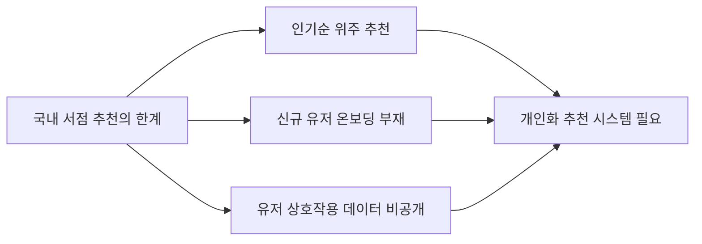
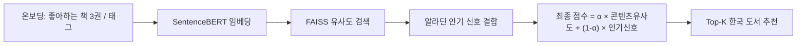

# Korean Book Hybrid Recommender

- 콘텐츠 임베딩과 협업 필터링을 결합한 한국 도서 개인화 추천 시스템

## 목차

- 👤 [개요](#-개요)
- ✅ [문제 정의](#-문제-정의)
- 💡 [가설 설정](#-가설-설정)
- 🔬 [실험 및 검증](#-실험-및-검증)
- 📊 [결론](#-결론)

---

## 👤 개요

- **개요**:
  - 국내 대형 서점의 추천 시스템은 대부분 판매량·조회수 기반의 인기 순위에 의존하며, 신규 유저를 위한 온보딩 과정이 부재합니다.
  - 국내 도서의 유저-상호작용 데이터가 공개되지 않는 현실적 제약 속에서, 콘텐츠 임베딩(실서비스)과 협업 필터링 벤치마크(방법론 검증)를 분리한 이중 트랙 하이브리드 추천 시스템을 설계했습니다.
- **기간/인원**: 2025.01 ~ 2025.08 (8개월) / 개인 프로젝트
- **주요 역할**:
  - 알라딘 OpenAPI 기반 한국 도서 데이터 수집 (6,974권)
  - SentenceBERT + FAISS 콘텐츠 임베딩 파이프라인 구축
  - Book-Crossing 협업 필터링 6종 벤치마크 실험
  - 하이브리드 결합 로직 설계 및 Streamlit 배포 (기획~배포 전 과정 단독 수행)
- **배운 점**:
  - 유저 상호작용 데이터가 없는 상황에서도 콘텐츠 기반 접근으로 개인화를 구현할 수 있음을 확인
  - 모델 복잡도가 항상 성능으로 이어지지 않는다는 것을 NCF 실험으로 실증
  - 실서비스 온보딩 UX(Path A/B)까지 고려한 설계 경험

---

## ✅ 문제 정의

- **왜 이 문제를 풀어야 하는가?**
  - 로그인하지 않은 신규 유저는 서점 사이트에서 개인화 추천을 전혀 받지 못합니다.
  - 협업 필터링에 필요한 국내 유저-도서 상호작용 데이터는 어디에도 공개되어 있지 않습니다.
  - 이 두 제약을 동시에 해결하려면, 콘텐츠 자체의 의미 정보만으로 추천이 가능한 구조가 필요합니다.

---

## 💡 가설 설정

- **가설 1: 협업 필터링에서 모델이 복잡할수록(Neural CF) 성능이 더 좋을 것이다.**
  - 검증 방법: Book-Crossing 벤치마크로 Baseline 3종(Popularity/User-CF/Item-CF), MF 2종(SVD/ALS), Neural CF를 동일 조건에서 비교
  - **결과: 기각.** NCF(NDCG@10=0.0168)는 Popularity(0.0172) 수준으로 저조했으며, ALS(0.0444)가 최고 성능을 기록했습니다.
  - Sparsity 99.82%의 극단적 희소 데이터에서는 잠재 요인 기반 선형 모델(ALS)이 신경망보다 안정적으로 학습됨을 확인했습니다.

- **가설 2: 유저 상호작용 데이터 없이도 콘텐츠 임베딩만으로 신규 유저에게 즉시 유의미한 추천이 가능할 것이다.**
  - 검증 방법: 좋아하는 책 3권 입력(Path A) 및 태그 선택(Path B) 시나리오로 정성 평가
  - **결과: 채택.** 두 경로 모두에서 카테고리·주제가 일관된 추천 결과를 확인했습니다.

---

## 🔬 실험 및 검증

- **하이브리드 아키텍처**

- **데이터셋**
  - 콘텐츠: 알라딘 OpenAPI로 수집한 한국 도서 6,974권 (제목·저자·카테고리·소개문)
  - 협업 필터링 벤치마크: Kaggle Book-Crossing (필터링 후 115,364건 평점, Sparsity 99.82%)

- **실험 1: 협업 필터링 6종 벤치마크 (NDCG@10)**

| Model | NDCG@10 | 구분 | 비고 |
|---|---|---|---|
| Popularity | 0.0172 | Baseline | 개인화 없는 인기순 |
| User-CF | 0.0046 | Baseline | Sparsity로 성능 최저 |
| Item-CF | 0.0258 | Baseline | Baseline 중 최고 |
| SVD | 0.0388 | MF | 잠재요인 기반 개선 |
| **ALS** | **0.0444** | MF | **최고 성능, Baseline 대비 +72.4%** |
| NCF | 0.0168 | Neural | Popularity 수준으로 저조 |

- **실험 2: 하이브리드 정성 평가**
  - Path A(주관식): "달러구트 꿈 백화점" 등 3권 입력 → 유사 주제(힐링·성장) 한국 도서로 정확히 매칭
  - Path B(객관식): "자기계발·성장·깊이있는" 태그 조합 → 해당 카테고리 도서로 정확히 매칭
  - α 파라미터(0.0~1.0) 조절 시 개인화-인기 비중이 실제로 추천 순위에 반영됨을 확인

---

## 📊 결론

- **결론 1: 모델 복잡도보다 데이터 특성과 알고리즘의 정합성이 중요하다**
  - ALS가 Baseline 최고(Item-CF) 대비 NDCG@10 +72.4%를 달성하며 협업 필터링 방법론의 우위를 확인했습니다.
  - Neural CF는 Popularity 수준으로 저조했으며, 이는 Rendle et al.(2020)의 결론을 실증적으로 재현한 결과입니다.
  - 기대효과: 데이터 sparsity를 사전에 진단하고 알고리즘을 선택하는 실무적 판단 기준을 확보했습니다.
- **결론 2: 데이터 접근성 제약을 이중 트랙 설계로 해결**
  - 콘텐츠 임베딩(실서비스)과 협업 필터링(방법론 검증)을 분리해 국내 데이터 부재 문제를 우회했습니다.
  - 기대효과: 신규 유저도 첫 진입부터 즉시 개인화 추천을 받을 수 있는 실서비스 형태로 배포했습니다.
