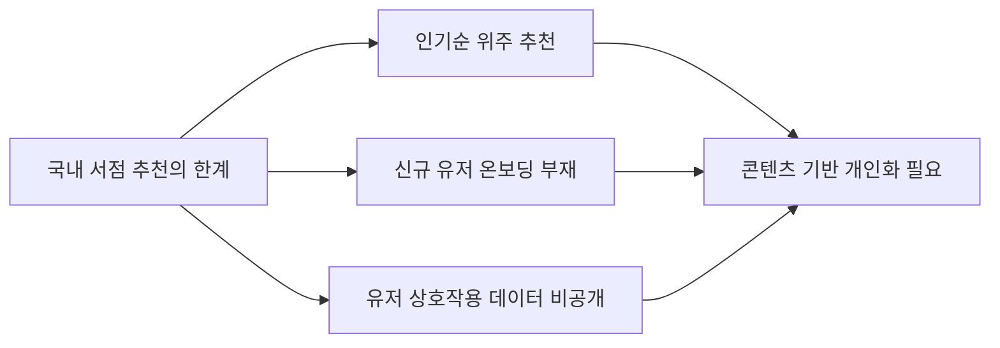
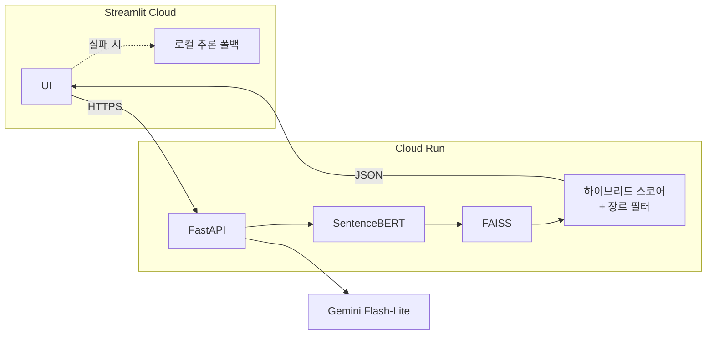

# Korean Book Hybrid Recommender

- 콘텐츠 임베딩과 협업 필터링을 결합한 추천 시스템을 API로 서빙하고 RAG로 확장한 프로젝트

## 목차

- 👤 [개요](#-개요)
- ✅ [문제 정의](#-문제-정의)
- 💡 [가설 설정](#-가설-설정)
- 🔬 [실험 및 검증](#-실험-및-검증)
- 🛠 [운영 과정에서 발견한 문제](#-운영-과정에서-발견한-문제)
- 📊 [결론](#-결론)

---

## 👤 개요

- **개요**:
  - 국내 대형 서점의 추천 시스템은 대부분 판매량·조회수 기반의 인기 순위에 의존하며,
    신규 유저를 위한 온보딩 과정이 부재합니다.
  - 국내 도서의 유저-상호작용 데이터가 공개되지 않는 제약 속에서, 콘텐츠 임베딩(실서비스)과
    협업 필터링 벤치마크(방법론 검증)를 분리한 이중 트랙 하이브리드를 설계했습니다.
  - 이후 추천 모델을 **API로 분리해 컨테이너화하고 Cloud Run에 배포**했으며,
    추천 근거를 설명하는 **RAG 기능**을 추가했습니다.
- **기간/인원**: 2025.01 ~ 2025.08 (8개월) / 개인 프로젝트
- **주요 역할** (기획부터 배포까지 단독 수행):
  - 알라딘 OpenAPI 기반 한국 도서 데이터 수집 (6,974권)
  - SentenceBERT + FAISS 콘텐츠 임베딩 파이프라인 구축
  - Book-Crossing 협업 필터링 6종 벤치마크 실험
  - FastAPI 서빙 · Docker 컨테이너화 · GitHub Actions CI · Cloud Run 배포
  - Gemini 기반 RAG 설명 기능 및 장르 메타데이터 필터 구현
- **배운 점**:
  - 모델 복잡도가 항상 성능으로 이어지지 않는다는 것을 NCF 실험으로 실증
  - 벡터 검색은 유사도 검색이지 필터가 아니며, 범주 조건은 메타데이터로 보장해야 함
  - 외부 LLM API는 모델·인증·SDK 모든 계층에서 변경되므로 설정 분리와 폴백이 필수
  - 헬스체크에 무엇을 담느냐가 실제 장애 탐지 시점을 좌우함

---

## ✅ 문제 정의


```mermaid
flowchart LR
    A["국내 서점 추천의 한계"] --> B["인기순 위주 추천"]
    A --> C["신규 유저 온보딩 부재"]
    A --> D["유저 상호작용 데이터 비공개"]
    B --> E["콘텐츠 기반 개인화 필요"]
    C --> E
    D --> E
```

- **왜 이 문제를 풀어야 하는가?**
  - 로그인하지 않은 신규 유저는 서점 사이트에서 개인화 추천을 전혀 받지 못합니다.
  - 협업 필터링에 필요한 국내 유저-도서 상호작용 데이터는 공개되어 있지 않습니다.
  - 이 두 제약을 동시에 해결하려면, 콘텐츠 자체의 의미 정보만으로 추천이 가능한
    구조가 필요합니다.

---

## 💡 가설 설정

### 가설 1: 협업 필터링에서 모델이 복잡할수록(Neural CF) 성능이 좋을 것이다.

- **검증 방법**: Book-Crossing 벤치마크로 Baseline 3종(Popularity / User-CF / Item-CF),
  MF 2종(SVD / ALS), Neural CF를 동일 조건에서 비교
- **결과: 기각.** NCF(NDCG@10=0.0168)는 Popularity(0.0172) 수준으로 저조했고,
  ALS(0.0444)가 최고 성능을 기록했습니다.
- Sparsity 99.82%의 극단적 희소 데이터에서는 잠재 요인 기반 선형 모델이 신경망보다
  안정적으로 학습됨을 확인했습니다. Rendle et al.(2020)의 결론과 일치합니다.

### 가설 2: 유저 상호작용 데이터 없이도 콘텐츠 임베딩만으로 신규 유저에게 유의미한 추천이 가능할 것이다.

- **검증 방법**: 좋아하는 책 3권 입력(Path A), 태그 선택(Path B) 시나리오로 정성 평가
- **결과: 채택.** 두 경로 모두에서 카테고리·주제가 일관된 추천 결과를 확인했습니다.

### 가설 3: 태그를 임베딩에 반영하면 해당 장르가 추천 결과에 보장될 것이다.

- **검증 방법**: Path B에서 "소설" 태그를 선택하고 결과의 카테고리 분포 확인
- **결과: 기각.** 에세이가 결과에 포함되었습니다.
- 태그는 쿼리 벡터의 방향에 영향을 줄 뿐 `장르 = 소설`이라는 **조건이 아닙니다.**
  정서가 유사한 타 장르 도서가 벡터 공간에서 더 가까울 수 있습니다.
  → 메타데이터 필터를 후처리로 추가해 해결했습니다.

### 가설 4: RAG로 추천 근거를 설명하면 추천 결과의 설득력을 높일 수 있다.

- **검증 방법**: FAISS 검색 결과를 컨텍스트로 구성해 LLM이 설명을 생성하도록 하고,
  생성된 설명이 실제 도서 정보에 근거하는지 확인
- **결과: 조건부 채택.** 소개문이 충분한 도서는 근거 있는 설명이 생성되었으나,
  소개문이 짧은 도서(평균 132자)는 설명 품질이 제한적이었습니다.
- LLM 자체 지식을 허용하면 설명은 풍부해지지만 **신간·무명 도서에서 환각이 발생**하므로,
  검색 결과만 근거로 삼고 정보 부족 시 그렇다고 밝히도록 설계했습니다.

---

## 🔬 실험 및 검증

### 시스템 아키텍처


```mermaid
flowchart LR
    subgraph FE["Streamlit Cloud"]
        ST["UI"]
        LF["로컬 추론 폴백"]
    end
    subgraph GCP["Cloud Run"]
        API["FastAPI"]
        SB["SentenceBERT"]
        FS["FAISS"]
        HB["하이브리드 스코어<br/>+ 장르 필터"]
    end
    LLM["Gemini Flash-Lite"]

    ST -->|HTTPS| API
    ST -.->|실패 시| LF
    API --> SB --> FS --> HB
    HB -->|JSON| ST
    API --> LLM
```

**하이브리드 결합**: `최종 점수 = α × 콘텐츠 유사도 + (1 − α) × 인기 신호`

### 데이터셋

| 항목 | 내용 |
|---|---|
| 콘텐츠 | 알라딘 OpenAPI 한국 도서 6,974권 (제목·저자·카테고리·소개문) |
| CF 벤치마크 | Kaggle Book-Crossing (필터링 후 115,364건, Sparsity 99.82%) |
| 임베딩 | `paraphrase-multilingual-MiniLM-L12-v2` (384차원) |

### 실험 1: 협업 필터링 6종 벤치마크 (NDCG@10)

| Model | NDCG@10 | 구분 | 비고 |
|---|---|---|---|
| Popularity | 0.0172 | Baseline | 개인화 없는 인기순 |
| User-CF | 0.0046 | Baseline | Sparsity로 성능 최저 |
| Item-CF | 0.0258 | Baseline | Baseline 중 최고 |
| SVD | 0.0388 | MF | 잠재요인 기반 개선 |
| **ALS** | **0.0444** | MF | **최고 성능, Baseline 대비 +72.4%** |
| NCF | 0.0168 | Neural | Popularity 수준으로 저조 |

최고 성능인 ALS조차 Precision@10 = 0.017 수준으로, **협업 필터링 단독으로는 sparse
데이터의 한계를 넘기 어렵다**는 것을 정량적으로 확인했습니다. 이것이 콘텐츠 기반
하이브리드를 주력으로 택한 근거입니다.

### 실험 2: 하이브리드 정성 평가

- **Path A**: "달러구트 꿈 백화점" 등 3권 입력 → 유사 주제(힐링·성장) 도서로 매칭
- **Path B**: "자기계발·성장·깊이있는" 태그 조합 → 해당 카테고리 도서로 매칭
- **α 조절**: 0.0~1.0 변화 시 개인화-인기 비중이 실제 순위에 반영됨을 확인

### 실험 3: 메타데이터 필터링

벡터 검색이 범주를 보장하지 못하는 문제(가설 3)를 후처리 필터로 해결했습니다.

```
FAISS over-fetch (top_k × 10)
  → 하이브리드 스코어 정렬
  → 허용 카테고리 필터
  → 결과 부족 시 완화 (graceful degradation)
```

**어떤 태그를 필터로 쓸지**가 설계의 핵심이었습니다.

| 태그 유형 | 필터 | 판단 |
|---|---|---|
| 장르 (소설, 에세이, 인문, 과학) | ✅ | 사용자가 명확히 지정한 범주 |
| 서브장르 (판타지, SF, 추리, 로맨스) | ✅ 소설 계열로 한정 | 소설의 하위 분류 |
| 정서 (따뜻한, 묵직한, 감동적인) | ❌ | 어떤 장르에나 존재 |
| 힐링, 성장 | ❌ | 에세이·자기계발에도 걸쳐 있어 한정하면 손실 |

"힐링"을 필터로 쓰면 좋은 에세이가 걸러지므로, 정서 태그는 벡터 유사도에만 맡겼습니다.

### 실험 4: RAG 설명 생성

| 항목 | 결정 | 이유 |
|---|---|---|
| 호출 시점 | 사용자 버튼 클릭 | 추천 40ms vs LLM 2~5초. 자동 생성 시 전원 대기 |
| 컨텍스트 | 실제 도서 메타데이터만 | 자체 지식 허용 시 없는 줄거리 생성 위험 |
| temperature | 0.4 | 창의성보다 근거 충실도 우선 |
| 캐싱 | 입력 조합 + 모델 ID 단위 | 지연·비용·rate limit 동시 완화 |
| 실패 처리 | 200 + `explanation: null` | 부가 기능이 핵심 기능을 중단시키지 않음 |

캐시 키에 **모델 ID를 포함**한 것은, 모델이 교체되면 설명 품질이 달라지므로 이전 모델의
캐시가 반환되면 안 되기 때문입니다.

---

## 🛠 운영 과정에서 발견한 문제

모델을 서비스로 만드는 과정에서, 모델링 단계에서는 드러나지 않는 문제들을 겪었습니다.

### 1. 데이터-인덱스 정합성

컨테이너 배포 후 `/health` 응답에서 불일치를 발견했습니다.

```json
{ "index_size": 6881, "total_books": 6974 }
```

FAISS는 벡터를 **순번**으로 관리하고 그 순번으로 메타데이터를 조회합니다
(`books.iloc[indices]`). 개수가 어긋났다는 것은 최소 93권이 검색에서 누락되었거나,
최악의 경우 **행이 밀려 잘못된 도서 정보가 반환**될 수 있음을 의미했습니다.
성능 지표로는 드러나지 않고 조용히 잘못된 결과를 내보내는 유형의 결함입니다.

**대응**: 서빙 파일을 단일 기준으로 삼는 인덱스 재생성 스크립트를 작성하고, API 기동 시
정합성을 검증해 불일치하면 즉시 실패하도록 했습니다. CI에도 동일 검증을 추가했습니다.

**배운 점**: 헬스체크를 단순 생존 확인이 아니라 **핵심 자원의 정합성까지 노출**하도록
설계한 덕분에 배포 직후 문제를 발견할 수 있었습니다.

### 2. 외부 LLM 의존성 변화

연동 과정에서 공급자 측 변경을 연달아 겪었습니다.

| 변경 | 대응 |
|---|---|
| 사용하던 모델의 지원 중단 → 429 오류 | 모델 ID를 폴백 체인으로 분리 |
| API 키 형식 전환 | 문서 확인 후 신규 형식 적용 |
| SDK 패키지 지원 종료 | 후속 SDK로 마이그레이션 |

클라이언트 객체 생성만으로는 모델 가용성을 알 수 없었습니다. 지원 중단된 모델도 객체는
정상 생성되고 **첫 사용 시점에야 429가 발생**했습니다. 그래서 초기화 단계에서 짧은
프롬프트로 실호출해 검증하도록 했습니다.

### 3. 배포 환경 제약

| 제약 | 대응 |
|---|---|
| Streamlit Cloud 메모리 1GB | 임베딩 모델 경량화 (450MB → 118MB) |
| Cloud Run `PORT` 주입 | 환경변수 기반으로 로컬·클라우드 단일 이미지 대응 |
| 신규 GCP 프로젝트 IAM 축소 | 빌드 파이프라인에 필요한 권한 4종 부여 |

임베딩 모델 교체는 **정확도와 서비스 안정성 사이의 트레이드오프**였습니다. 한국어 특화
모델이 성능은 우수했지만 배포 환경에서 안정적으로 동작하지 않아, 성능 손실을 감수하고
경량 모델을 택했습니다.

---

## 📊 결론

### 결론 1: 모델 복잡도보다 데이터 특성과의 정합성이 중요하다

- ALS가 Baseline 최고 대비 NDCG@10 +72.4%를 달성한 반면, Neural CF는 Popularity
  수준으로 저조했습니다.
- **기대효과**: 데이터 sparsity를 사전에 진단하고 알고리즘을 선택하는 판단 기준을
  확보했습니다.

### 결론 2: 데이터 접근성 제약을 이중 트랙 설계로 해결

- 콘텐츠 임베딩(실서비스)과 협업 필터링(방법론 검증)을 분리해 국내 데이터 부재 문제를
  우회했습니다.
- **기대효과**: 신규 유저도 첫 진입부터 즉시 개인화 추천을 받을 수 있습니다.

### 결론 3: 벡터 검색만으로는 범주 조건을 보장할 수 없다

- 임베딩에 태그를 반영해도 장르가 보장되지 않아, 메타데이터 필터를 후처리로 추가했습니다.
- 필터 대상을 장르 태그로 한정하고 정서 태그는 제외한 것이 핵심 판단이었습니다.
- **기대효과**: 벡터 검색과 메타데이터 필터의 역할을 구분해 설계하는 관점을 확보했습니다.

### 결론 4: 모델을 만드는 것과 서비스로 운영하는 것은 다르다

- API 분리 → 컨테이너화 → CI → 클라우드 배포 과정에서, 모델링 단계에서는 드러나지
  않는 문제(정합성, 의존성 변화, 환경 제약)를 겪었습니다.
- **기대효과**: 외부 의존성 실패가 핵심 기능을 중단시키지 않도록 폴백을 설계하고,
  문제를 조기에 탐지하는 관측 지점을 두는 습관을 확보했습니다.

### 한계

- **개인화의 한계**: 유저 개별 이력 없이 콘텐츠 유사도 + 전체 평균 인기만 결합.
  실서비스에서는 유저 로그 축적 후 CF 재도입이 필요합니다.
- **정량 평가 부재**: 국내 도서 상호작용 데이터가 없어 최종 하이브리드는 정성 평가로만
  검증했습니다.
- **카테고리 세분화**: `cat_main`이 "소설/시/희곡"으로 묶여 있어 "시"만 선택해도 소설이
  함께 나옵니다.
- **콜드 스타트**: Cloud Run이 0으로 스케일다운되어 유휴 후 첫 요청이 20~40초 소요됩니다.
