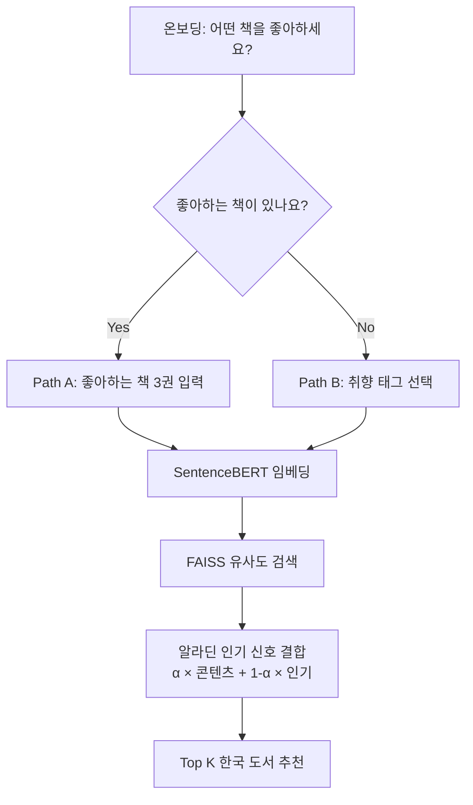

# 📚 한국 도서 하이브리드 추천 시스템

> 알라딘 API + SentenceBERT + FAISS + 협업 필터링 기반 개인화 도서 추천

**🔗 [Live Demo 바로가기](https://korean-book-recommender.streamlit.app/)**

---

## 📌 프로젝트 개요

국내 대형 서점(교보문고, 알라딘, YES24)의 추천 시스템은 대부분 판매량·조회수 기반의 **인기 순위**에 의존한다. 독자의 개별 취향을 반영한 개인화 추천은 미흡하며, 특히 신규 이용자를 위한 **온보딩 과정이 부재**하다.

본 프로젝트는 이 문제를 해결하기 위해 **콘텐츠 기반 추천(SentenceBERT + FAISS)**과 **협업 필터링(Book-Crossing 벤치마크)**을 결합한 하이브리드 추천 시스템을 설계·구축·배포했다.

- **기간**: 2026.07
- **데이터**: 알라딘 OpenAPI (한국 도서 7,725권 수집 → 6,974권 정제) + Kaggle Book-Crossing (115,364건 평점)
- **핵심 설계**: 국내 유저-도서 상호작용 데이터가 공개되지 않는 현실적 제약을 인정하고, 콘텐츠 임베딩(실서비스)과 협업 필터링(방법론 검증)을 분리한 **이중 트랙 아키텍처**

---

## 🎯 핵심 성과

| 항목 | 값 |
|---|---|
| 수집 한국 도서 | 6,974권 (알라딘 API) |
| 임베딩 모델 | Multilingual MiniLM (384차원) |
| 협업 필터링 벤치마크 | 6종 모델 (Baseline 3 + MF 2 + Neural 1) |
| 최고 CF 성능 | ALS, NDCG@10 +72.4% (Baseline 대비) |
| 딥러닝 실험 결과 | NCF는 Popularity 수준으로 저조 (정직하게 리포트) |
| 배포 | Streamlit Cloud, 4페이지 인터랙티브 앱 |

---

## 🛠️ 사용 기술

- **언어**: Python 3.12
- **데이터 수집**: `aiohttp` (비동기 병렬), `requests`
- **콘텐츠 임베딩**: `sentence-transformers`, `FAISS`
- **협업 필터링**: `implicit` (ALS), `scikit-learn` (SVD), `PyTorch` (NCF)
- **데이터 처리**: `pandas`, `numpy`, `pyarrow`
- **배포**: `Streamlit`, Streamlit Cloud

---

## 📂 프로젝트 구조

```text
korean-book-recommender/
├── streamlit_app.py               # 홈 페이지
├── pages/
│   ├── 1_📖_책_추천받기.py         # Path A/B 하이브리드 추천
│   ├── 2_📊_협업_필터링_실험.py     # 6종 CF 모델 비교
│   └── 3_📝_결론과_한계.py         # 프로젝트 회고
├── data/
│   ├── books_streamlit.parquet    # 도서 메타데이터 + 인기 점수
│   ├── config.json                # 시스템 설정
│   ├── tag_templates.json         # 태그 → 자연어 매핑
│   └── cf_final_comparison.csv    # CF 실험 결과
├── models/
│   └── faiss_index.bin            # 벡터 검색 인덱스
├── src/
│   └── hybrid_recommender.py      # 재사용 추천 클래스
├── notebooks/                     # 전체 분석 노트북 (Colab)
├── requirements.txt
└── README.md
```

## 🏗️ 시스템 아키텍처



**하이브리드 결합 공식**: `최종 점수 = α × 콘텐츠 유사도 + (1 − α) × 인기 신호`

- α = 1.0: 순수 콘텐츠 기반 (개인화 강조)
- α = 0.0: 순수 인기순
- α = 0.7 (기본값): 개인화 우선 + 콜드 스타트 완화

## 🔬 분석 및 모델링 흐름

### 1. 데이터 수집
- 알라딘 OpenAPI로 22개 카테고리 순회, 비동기 병렬 처리로 7,725권 수집
- Kaggle Book-Crossing 벤치마크: 27만 유저 × 27만 도서 → 필터링 후 6,862 유저 × 9,096 도서

### 2. 콘텐츠 임베딩 (Process 2)
- 한국어 SentenceBERT 3개 모델 정성 비교 후 최종 선정
- FAISS `IndexFlatIP`로 밀리초 단위 유사도 검색 구축
- Streamlit Cloud 메모리 제약으로 다국어 경량 모델(MiniLM, 384차원)로 최적화

### 3. 협업 필터링 벤치마크 (Process 3)
| 모델 | NDCG@10 | Baseline 대비 |
|---|---|---|
| User-CF | 0.0046 | -82% |
| Popularity | 0.0172 | 기준 |
| Item-CF | 0.0258 | +50% (Baseline 최고) |
| NCF | 0.0168 | -35% (예상외 저조) |
| SVD | 0.0388 | +50.6% |
| **ALS** | **0.0444** | **+72.4%** |

### 4. 하이브리드 통합 (Process 4)
- 콘텐츠 임베딩(주력) + 알라딘 인기 신호(보조) 결합
- Path A(주관식)/Path B(객관식) 온보딩 UX 설계
- 3가지 시나리오로 정성 평가 검증

### 5. 배포 (Process 5)
- Streamlit Cloud 무료 티어 최적화 (SentenceBERT 지연 로딩, 경량 모델 교체)
- 4페이지 인터랙티브 앱 구축

---

## 💡 주요 발견

1. **데이터 접근성 제약을 설계에 반영** — 국내 유저-상호작용 데이터 부재를 인정하고, 콘텐츠 임베딩(실서비스)과 CF(방법론 검증)를 분리한 이중 트랙으로 해결
2. **딥러닝이 항상 우수하지 않다** — NCF가 Popularity 수준으로 저조. Rendle et al.(2020) 논문의 결론을 실증적으로 재현
3. **CF 단독의 근본적 한계** — 최고 성능(ALS)도 Precision@10 = 0.017 수준. 콘텐츠 기반 하이브리드의 필요성을 정량적으로 뒷받침
4. **온보딩 UX까지 고려한 설계** — 기술 구현을 넘어 실제 서비스 시나리오(Path A/B) 반영

---

## ⚠️ 한계 및 향후 개선

- **개인화의 한계**: 유저 개별 이력 없이 콘텐츠 유사도 + 전체 평균 인기만 결합 → 실서비스에서는 유저 로그 축적 후 CF 재도입 필요
- **정량 평가 부재**: 국내 도서 상호작용 데이터가 없어 최종 하이브리드 시스템은 정성 평가로만 검증
- **배포 환경 제약**: Streamlit Cloud 무료 티어 메모리 한계로 임베딩 모델을 경량화 (성능 손실 정량 미확인)

자세한 회고는 배포된 앱의 **[결론과 한계]** 페이지에서 확인 가능합니다.

---

## 🚀 실행 방법

### 로컬 실행

```bash
git clone https://github.com/pssjun/korean-book-recommender.git
cd korean-book-recommender

pip install -r requirements.txt
streamlit run streamlit_app.py
```

### 배포 URL
- **Streamlit Cloud**: https://korean-book-recommender.streamlit.app/

---

## ⚠️ 참고 사항

- 브라우저 자동 번역 기능을 **끄고** 접속해 주세요 (한글 UI 왜곡 방지)
- 첫 검색 시 AI 모델 로딩으로 30초~1분 소요될 수 있습니다
- Streamlit Cloud 무료 티어 특성상 장시간 미사용 시 앱이 슬립 상태가 될 수 있습니다

---

## 📊 데이터 출처

- [알라딘 OpenAPI](https://blog.aladin.co.kr/openapi/popup/6695306)
- [Kaggle Book-Crossing Dataset](https://www.kaggle.com/datasets/arashnic/book-recommendation-dataset)

---

## 👤 About

- **작성자**: pssjun
- **프로젝트 유형**: 데이터 사이언스 포트폴리오 (신입 취업 준비)
- **관련 프로젝트**: [EV 충전소 수요 예측](https://github.com/pssjun/ev-charging-forecast)