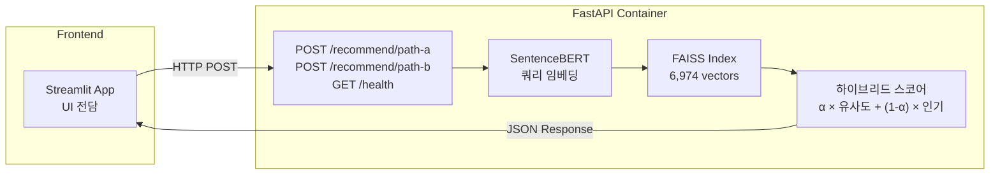

# 📚 한국 도서 하이브리드 추천 시스템

[](https://github.com/pssjun/korean-book-recommender/actions/workflows/docker-build.yml)


> **콘텐츠 임베딩과 협업 필터링을 결합한 추천 모델을, API 서버로 분리하고 컨테이너로 배포한 End-to-End ML 서비스**

한국 도서 6,974권을 SentenceBERT로 임베딩하고 FAISS로 검색하는 추천 엔진을 FastAPI로 서빙합니다. Docker 컨테이너로 배포하며, GitHub Actions가 push마다 빌드·헬스체크·데이터 정합성·추천 응답·입력 검증을 자동으로 확인합니다.

**🔗 [Live Demo](https://korean-book-recommender.streamlit.app/) · [API 문서 (로컬 실행 후)](http://localhost:8000/docs)**

---

## 📌 한눈에 보기

| | |
|---|---|
| **문제** | 국내 서점 추천은 인기순 위주이며 신규 유저 온보딩이 부재. 국내 도서의 유저-상호작용 데이터는 비공개 |
| **접근** | 콘텐츠 임베딩(실서비스)과 협업 필터링(방법론 검증)을 분리한 이중 트랙 하이브리드 |
| **서빙** | FastAPI + Docker. 모델은 컨테이너 기동 시 1회 로딩 후 메모리 상주 |
| **검증** | CI에서 빌드·헬스체크·데이터 정합성·추천 응답·입력 검증 자동 확인 |
| **기간/인원** | 2025.01 – 2025.08 (8개월) / 개인 프로젝트 |

---

## 🛠 기술 스택

**Serving & Infra**
`FastAPI` · `Uvicorn` · `Pydantic` · `Docker` · `docker-compose` · `GitHub Actions`

**ML & Retrieval**
`SentenceBERT` · `FAISS` · `PyTorch` · `implicit(ALS)` · `scikit-learn`

**Data & Frontend**
`pandas` · `pyarrow` · `Streamlit` · `알라딘 OpenAPI`

---

## 🎯 핵심 성과

### 모델링

- 한국 도서 **6,974권** 콘텐츠 임베딩(SentenceBERT + FAISS) 파이프라인 구축
- 협업 필터링 **6종 벤치마크**(Popularity / User-CF / Item-CF / SVD / ALS / Neural CF) 수행
- **ALS가 Baseline 대비 NDCG@10 +72.4%** 달성
- Neural CF가 Popularity 수준으로 저조한 결과를 원인 분석과 함께 리포트 (Rendle et al. 2020 재현)

### 서빙 & 인프라

- Streamlit 단일 앱 → **FastAPI API 서버로 분리**, 추천 로직 재사용 가능한 구조로 전환
- **Docker 컨테이너화** — 빌드 시점 모델 사전 다운로드로 Cold Start 제거, 레이어 캐싱 최적화
- **Pydantic 스키마 검증** — 범위를 벗어난 입력이 모델에 도달하기 전 422로 차단
- **관측 가능성** — 요청 로깅 미들웨어, `X-Process-Time-Ms` 헤더, `/health` 엔드포인트

### 품질 관리

- **CI 통합 테스트 구축** — push마다 이미지 빌드 후 컨테이너를 실제 기동하여 5단계 검증
- **데이터-인덱스 정합성 문제 발견 및 해결** — 헬스체크로 배포 직후 탐지, fail-fast 가드 + CI 검증으로 재발 방지

---

## ⚡ 빠른 시작

```bash
# API 서버 (Docker)
docker compose up --build
# → http://localhost:8000/docs

# 프론트엔드 (별도 터미널)
pip install -r requirements.txt
streamlit run streamlit_app.py
```

인덱스를 다시 만들어야 할 경우:

```bash
python scripts/build_index.py
```

---

## 🔌 API 개요

| Method | Endpoint | 설명 |
|---|---|---|
| `POST` | `/recommend/path-a` | 좋아하는 책 기반 추천 (취향 벡터 평균) |
| `POST` | `/recommend/path-b` | 태그 기반 추천 (콜드 스타트 대응) |
| `GET` | `/tags` | 사용 가능한 취향 태그 목록 |
| `GET` | `/health` | 모델 로딩 상태 및 데이터-인덱스 정합성 |

**요청 예시**

```bash
curl -X POST http://localhost:8000/recommend/path-a \
  -H "Content-Type: application/json" \
  -d '{"books":["달러구트 꿈 백화점","미드나잇 라이브러리"],"top_k":5,"alpha":0.7}'
```

**응답 예시**

```json
{
  "path": "A",
  "alpha": 0.7,
  "total_books_searched": 6974,
  "elapsed_ms": 42.7,
  "results": [
    {
      "rank": 1,
      "title": "...",
      "author": "...",
      "content_similarity": 0.7241,
      "popularity_score": 0.9200,
      "hybrid_score": 0.8034
    }
  ]
}
```

Swagger UI(`/docs`)에서 브라우저로 직접 호출해볼 수 있습니다.

## 🛠️ 사용 기술

- **언어**: Python 3.12
- **데이터 수집**: `aiohttp` (비동기 병렬), `requests`
- **콘텐츠 임베딩**: `sentence-transformers`, `FAISS`
- **협업 필터링**: `implicit` (ALS), `scikit-learn` (SVD), `PyTorch` (NCF)
- **데이터 처리**: `pandas`, `numpy`, `pyarrow`
- **배포**: `Streamlit`, Streamlit Cloud

---

## 📂 프로젝트 구조

```text
korean-book-recommender/
├── streamlit_app.py               # 홈 페이지
├── pages/
│   ├── 1_📖_책_추천받기.py         # Path A/B 하이브리드 추천
│   ├── 2_📊_협업_필터링_실험.py     # 6종 CF 모델 비교
│   └── 3_📝_결론과_한계.py         # 프로젝트 회고
├── data/
│   ├── books_streamlit.parquet    # 도서 메타데이터 + 인기 점수
│   ├── config.json                # 시스템 설정
│   ├── tag_templates.json         # 태그 → 자연어 매핑
│   └── cf_final_comparison.csv    # CF 실험 결과
├── models/
│   └── faiss_index.bin            # 벡터 검색 인덱스
├── src/
│   └── hybrid_recommender.py      # 재사용 추천 클래스
├── notebooks/                     # 전체 분석 노트북 (Colab)
├── requirements.txt
└── README.md
```

## 🏗️ 시스템 아키텍처

프론트엔드와 추천 엔진을 분리하고, 추천 엔진을 컨테이너화하여 배포했습니다.


```mermaid
flowchart LR
    subgraph FE["Frontend"]
        ST[Streamlit App<br/>UI 전담]
    end

    subgraph API["FastAPI Container"]
        EP["POST /recommend/path-a<br/>POST /recommend/path-b<br/>GET /health"]
        SB[SentenceBERT<br/>쿼리 임베딩]
        FS[FAISS Index<br/>6,974 vectors]
        HB["하이브리드 스코어<br/>α × 유사도 + (1-α) × 인기"]
    end

    ST -->|HTTP POST| EP
    EP --> SB --> FS --> HB
    HB -->|JSON Response| ST
```

**하이브리드 결합 공식**: `최종 점수 = α × 콘텐츠 유사도 + (1 − α) × 인기 신호`

- α = 1.0: 순수 콘텐츠 기반 (개인화 강조)
- α = 0.0: 순수 인기순
- α = 0.7 (기본값): 개인화 우선 + 콜드 스타트 완화

---

## 🔄 아키텍처 전환: Streamlit 단일 앱 → API 분리

### 전환 배경

초기에는 Streamlit 앱 하나에 모델 로딩·검색·UI를 모두 담았습니다. 프로토타입 단계에서는 빠르게 검증할 수 있었지만, 배포 후 세 가지 문제가 드러났습니다.

| 문제 | 상세 |
|---|---|
| Cold Start | 첫 요청 시 SentenceBERT(450MB) 다운로드·로딩으로 수십 초 대기 |
| 메모리 제약 | Streamlit Cloud 무료 티어(1GB)에서 모델+인덱스 동시 상재 시 불안정 |
| 재사용성 부재 | 추천 로직이 UI 코드에 결합되어 다른 클라이언트에서 호출 불가 |

### 전환 전후 비교

| 항목 | Before (Streamlit 단일) | After (FastAPI + Docker) |
|---|---|---|
| 모델 로딩 | 요청 시점 로딩 (지연 발생) | 컨테이너 기동 시 1회 로딩 후 메모리 상주 |
| 프론트 의존성 | torch, sentence-transformers, faiss 포함 | streamlit, pandas, requests만 |
| 추천 로직 위치 | UI 코드에 결합 | API 서버로 분리 (재사용 가능) |
| 입력 검증 | 수동 처리 | Pydantic 스키마 자동 검증 (422 응답) |
| 상태 확인 | 불가 | `/health` 엔드포인트 |
| 응답 시간 측정 | 불가 | 미들웨어로 전 요청 기록 + `X-Process-Time-Ms` 헤더 |

### 선택의 트레이드오프

**Streamlit 단일 앱을 유지하는 선택지**도 있었습니다. 배포 대상이 하나로 단순하고, 네트워크 홉이 없어 지연도 적습니다.

그럼에도 분리를 선택한 이유는, 이 프로젝트의 목표가 "동작하는 데모"가 아니라 **"모델을 서비스로 제공하는 구조"의 검증**이었기 때문입니다. 대신 분리로 생기는 비용(배포 대상 2개, 네트워크 호출 추가)은 다음과 같이 완화했습니다.

- **Cold Start**: Dockerfile 빌드 단계에서 모델을 사전 다운로드해 컨테이너 첫 실행 지연 제거
- **운영 복잡도**: `docker-compose.yml`로 단일 명령 기동
- **장애 대응**: Streamlit에서 API 연결 실패·타임아웃·HTTP 에러를 구분해 사용자에게 안내

---

## 🐳 Docker 구성

### 주요 설계 결정

| 항목 | 결정 | 이유 |
|---|---|---|
| Base Image | `python:3.12-slim` | 표준 이미지 대비 용량 절감 |
| 레이어 순서 | 의존성 설치 → 코드 복사 | 코드 수정 시 패키지 재설치 생략 (캐시 활용) |
| 모델 처리 | 빌드 시점 사전 다운로드 | 컨테이너 첫 실행 시 Cold Start 제거 |
| 헬스체크 | `HEALTHCHECK` + `start-period=60s` | 모델 로딩 시간을 고려한 유예 설정 |
| `.dockerignore` | Streamlit·노트북·원본 데이터 제외 | 이미지 용량 및 빌드 시간 절감 |

### 실행

```bash
# 빌드 & 실행
docker build -t book-recommender-api .
docker run -p 8000:8000 book-recommender-api

# 또는 compose
docker compose up --build
```

API 문서: `http://localhost:8000/docs` (Swagger UI 자동 생성)

---

## 🔍 트러블슈팅: 데이터-인덱스 정합성 문제

### 발견

컨테이너 배포 후 `/health` 응답에서 불일치를 확인했습니다.

```json
{
  "status": "ok",
  "model_loaded": true,
  "index_size": 6881,
  "total_books": 6974
}
```

### 문제의 심각성

FAISS는 벡터를 **순번(index)** 으로 관리하고, 검색 결과의 순번으로 도서 메타데이터를 조회합니다(`books.iloc[indices]`). 따라서 인덱스와 데이터프레임의 행 순서가 1:1로 정확히 대응해야 합니다.

개수가 어긋났다는 것은 최소 93권이 검색 대상에서 누락되었거나, 최악의 경우 **행이 밀려 잘못된 도서 정보가 반환**될 수 있음을 의미했습니다. 성능 지표로는 드러나지 않고 조용히 잘못된 결과를 내보내는 유형의 결함입니다.

### 원인

임베딩 생성 시점의 원본 파일과 실제 서빙 파일이 서로 달라 정합성이 깨진 상태였습니다.

### 해결

**1. 재현 가능한 인덱스 빌드 스크립트 작성** — 서빙에 사용하는 파일을 단일 기준(SSOT)으로 삼아 인덱스를 생성하고, 생성 과정에서 행 수를 검증합니다.

```bash
python scripts/build_index.py
```

**2. 기동 시 정합성 검증 (Fail Fast)** — API 로딩 단계에서 불일치를 감지하면 즉시 예외를 발생시켜 컨테이너가 뜨지 않도록 했습니다.

```python
if self.faiss_index.ntotal != len(self.books):
    raise RuntimeError(
        f"Data/Index mismatch: index={self.faiss_index.ntotal}, "
        f"books={len(self.books)}. Run scripts/build_index.py to rebuild."
    )
```

잘못된 추천을 조용히 서빙하는 것보다, 기동 시점에 명확히 실패하는 편이 안전하다고 판단했습니다.

### 배운 점

헬스체크를 단순 생존 확인(`{"status": "ok"}`)이 아니라 **핵심 자원의 정합성까지 노출**하도록 설계한 덕분에, 사용자 신고 이전에 배포 직후 문제를 발견할 수 있었습니다. 모니터링 엔드포인트에 어떤 지표를 담을지가 실제 장애 탐지 시점을 좌우한다는 것을 확인한 사례입니다.

---

## 📂 프로젝트 구조

```text
korean-book-recommender/
├── api/                          # FastAPI 추천 서버
│   ├── main.py                   # 엔드포인트, 미들웨어, lifespan
│   ├── recommender.py            # 추천 엔진 (모델·인덱스 관리)
│   └── schemas.py                # Pydantic 요청/응답 스키마
├── scripts/
│   └── build_index.py            # FAISS 인덱스 재생성 (정합성 검증 포함)
├── data/                         # 도서 메타데이터, 태그, 설정
├── models/                       # FAISS 인덱스
├── pages/                        # Streamlit 페이지 (API 클라이언트)
├── streamlit_app.py              # Streamlit 홈
├── Dockerfile
├── docker-compose.yml
├── requirements-api.txt          # API 서버 의존성
└── requirements.txt              # Streamlit 의존성 (경량)
```

## 💡 주요 발견

1. **데이터 접근성 제약을 설계에 반영** — 국내 유저-상호작용 데이터 부재를 인정하고, 콘텐츠 임베딩(실서비스)과 CF(방법론 검증)를 분리한 이중 트랙으로 해결
2. **딥러닝이 항상 우수하지 않다** — NCF가 Popularity 수준으로 저조. Rendle et al.(2020) 논문의 결론을 실증적으로 재현
3. **CF 단독의 근본적 한계** — 최고 성능(ALS)도 Precision@10 = 0.017 수준. 콘텐츠 기반 하이브리드의 필요성을 정량적으로 뒷받침
4. **온보딩 UX까지 고려한 설계** — 기술 구현을 넘어 실제 서비스 시나리오(Path A/B) 반영

---

## ⚠️ 한계 및 향후 개선

- **개인화의 한계**: 유저 개별 이력 없이 콘텐츠 유사도 + 전체 평균 인기만 결합 → 실서비스에서는 유저 로그 축적 후 CF 재도입 필요
- **정량 평가 부재**: 국내 도서 상호작용 데이터가 없어 최종 하이브리드 시스템은 정성 평가로만 검증
- **배포 환경 제약**: Streamlit Cloud 무료 티어 메모리 한계로 임베딩 모델을 경량화 (성능 손실 정량 미확인)

자세한 회고는 배포된 앱의 **[결론과 한계]** 페이지에서 확인 가능합니다.

---

## 🚀 실행 방법

### 로컬 실행

```bash
git clone https://github.com/pssjun/korean-book-recommender.git
cd korean-book-recommender

pip install -r requirements.txt
streamlit run streamlit_app.py
```

### 배포 URL
- **Streamlit Cloud**: https://korean-book-recommender.streamlit.app/

---

## ⚠️ 참고 사항

- 브라우저 자동 번역 기능을 **끄고** 접속해 주세요 (한글 UI 왜곡 방지)
- 첫 검색 시 AI 모델 로딩으로 30초~1분 소요될 수 있습니다
- Streamlit Cloud 무료 티어 특성상 장시간 미사용 시 앱이 슬립 상태가 될 수 있습니다

---

## 📊 데이터 출처

- [알라딘 OpenAPI](https://blog.aladin.co.kr/openapi/popup/6695306)
- [Kaggle Book-Crossing Dataset](https://www.kaggle.com/datasets/arashnic/book-recommendation-dataset)

---

## 👤 About

- **작성자**: pssjun
- **프로젝트 유형**: 데이터 사이언스 포트폴리오 (신입 취업 준비)
- **관련 프로젝트**: [EV 충전소 수요 예측](https://github.com/pssjun/ev-charging-forecast)

## 💡 주요 발견

1. **데이터 접근성 제약을 설계에 반영** — 국내 유저-상호작용 데이터 부재를 인정하고, 콘텐츠 임베딩(실서비스)과 CF(방법론 검증)를 분리한 이중 트랙으로 해결
2. **딥러닝이 항상 우수하지 않다** — NCF가 Popularity 수준으로 저조. Rendle et al.(2020) 논문의 결론을 실증적으로 재현
3. **CF 단독의 근본적 한계** — 최고 성능(ALS)도 Precision@10 = 0.017 수준. 콘텐츠 기반 하이브리드의 필요성을 정량적으로 뒷받침
4. **온보딩 UX까지 고려한 설계** — 기술 구현을 넘어 실제 서비스 시나리오(Path A/B) 반영

---

## ⚠️ 한계 및 향후 개선

- **개인화의 한계**: 유저 개별 이력 없이 콘텐츠 유사도 + 전체 평균 인기만 결합 → 실서비스에서는 유저 로그 축적 후 CF 재도입 필요
- **정량 평가 부재**: 국내 도서 상호작용 데이터가 없어 최종 하이브리드 시스템은 정성 평가로만 검증
- **배포 환경 제약**: Streamlit Cloud 무료 티어 메모리 한계로 임베딩 모델을 경량화 (성능 손실 정량 미확인)

자세한 회고는 배포된 앱의 **[결론과 한계]** 페이지에서 확인 가능합니다.

---

## 🚀 실행 방법

### 로컬 실행

```bash
git clone https://github.com/pssjun/korean-book-recommender.git
cd korean-book-recommender

pip install -r requirements.txt
streamlit run streamlit_app.py
```

### 배포 URL
- **Streamlit Cloud**: https://korean-book-recommender.streamlit.app/

---
📄 프로젝트 상세 리포트

문제 정의부터 가설 검증, 실험 결과까지 전체 연구 과정을 정리했습니다.

- [BOOK_OVERVIEW_KOR.md](./BOOK_OVERVIEW_KOR.md) — 개요 · 문제정의 · 가설설정 · 실험및검증 · 결론

## ⚠️ 참고 사항

- 브라우저 자동 번역 기능을 **끄고** 접속해 주세요 (한글 UI 왜곡 방지)
- 첫 검색 시 AI 모델 로딩으로 30초~1분 소요될 수 있습니다
- Streamlit Cloud 무료 티어 특성상 장시간 미사용 시 앱이 슬립 상태가 될 수 있습니다

---

## 📊 데이터 출처

- [알라딘 OpenAPI](https://blog.aladin.co.kr/openapi/popup/6695306)
- [Kaggle Book-Crossing Dataset](https://www.kaggle.com/datasets/arashnic/book-recommendation-dataset)

---

## 👤 About

- **작성자**: pssjun
- **프로젝트 유형**: 데이터 사이언스 포트폴리오 (신입 취업 준비)
- **관련 프로젝트**: [EV 충전소 수요 예측](https://github.com/pssjun/ev-charging-forecast)
