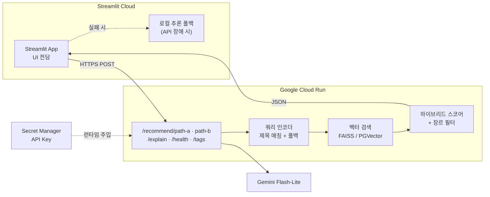
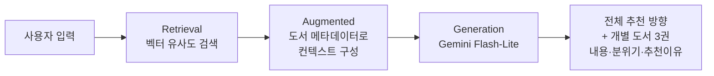
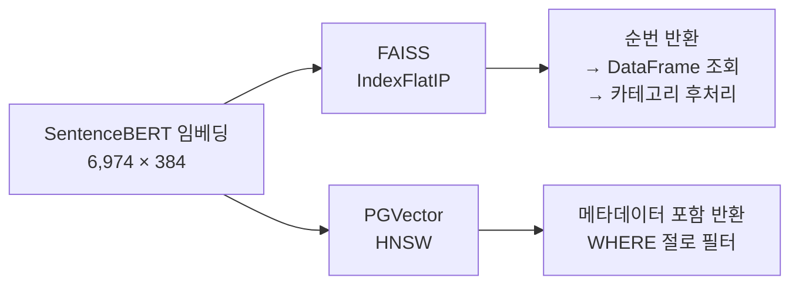

# 📚 한국 도서 하이브리드 추천 시스템

[](https://github.com/pssjun/korean-book-recommender/actions/workflows/docker-build.yml)


> **추천 모델을 API로 서빙하고, 컨테이너화·CI·RAG·클라우드 배포까지 확장한 End-to-End ML 서비스**

한국 도서 6,974권을 SentenceBERT로 임베딩하고 벡터 검색으로 추천하는 엔진을 FastAPI로 서빙합니다.
Docker로 컨테이너화해 **Google Cloud Run에 배포**했으며, GitHub Actions가 push마다 컨테이너를
실제로 기동해 7가지 항목을 검증합니다. 추천 근거 설명은 Gemini를 활용한 RAG로 생성합니다.

검색 백엔드는 **FAISS와 PGVector 두 가지로 구현**해 결과와 성능을 비교했고,
그 과정에서 발견한 검색 품질 결함을 해결했습니다.

🔗 **[Live Demo](https://korean-book-recommender.streamlit.app/)** ·
**[API 문서 (Swagger)](https://book-recommender-api-829972480350.asia-northeast3.run.app/docs)** ·
**[프로젝트 상세 리포트](./BOOK_OVERVIEW_KOR.md)**

---

## 🧭 이 프로젝트에서 다룬 엔지니어링 주제

모델 성능뿐 아니라 **모델을 서비스로 운영하는 과정에서 마주치는 문제들**을 다뤘습니다.

| 주제 | 내용 |
|---|---|
| **모델 서빙** | 모델 1회 로딩 후 상주, Pydantic 입력 검증, 응답시간 계측 미들웨어 |
| **컨테이너 이식성** | `PORT` 환경변수 대응으로 로컬(8000)·Cloud Run(8080) 동일 이미지 사용 |
| **클라우드 배포** | Cloud Run 배포, Secret Manager 연동, IAM 권한 구성 |
| **가용성 설계** | API 장애 시 프론트엔드 로컬 추론 폴백, 실행 모드 UI 노출 |
| **관측 가능성** | 자원 정합성까지 검사하는 헬스체크, 요청 로깅 |
| **CI 통합 테스트** | 컨테이너 실기동 후 7개 항목 자동 검증 |
| **LLM 프로덕션 이슈** | 환각 억제, 캐싱, 모델 폴백 체인, 지연·비용 트레이드오프 |
| **벡터 검색 설계** | FAISS·PGVector 비교, 메타데이터 필터, 쿼리-문서 비대칭 해결 |
| **비용 관리** | 인스턴스 상한, 이미지 정리 정책, 예산 알림 |

---

## 목차

- [📌 한눈에 보기](#-한눈에-보기)
- [🎯 핵심 성과](#-핵심-성과)
- [🛠 기술 스택](#-기술-스택)
- [⚡ 빠른 시작](#-빠른-시작)
- [🏗 시스템 아키텍처](#-시스템-아키텍처)
- [🔌 API 개요](#-api-개요)
- [☁️ Cloud Run 배포](#️-cloud-run-배포)
- [🔄 아키텍처 전환: Streamlit 단일 앱 → API 분리](#-아키텍처-전환-streamlit-단일-앱--api-분리)
- [🐳 Docker 구성](#-docker-구성)
- [🔐 시크릿 관리](#-시크릿-관리)
- [✅ CI 통합 테스트](#-ci-통합-테스트)
- [🤖 RAG 기반 추천 이유 설명](#-rag-기반-추천-이유-설명)
- [🏷 벡터 검색의 한계와 메타데이터 필터링](#-벡터-검색의-한계와-메타데이터-필터링)
- [🔎 쿼리-문서 비대칭 문제](#-쿼리-문서-비대칭-문제)
- [🗄 벡터 검색 백엔드 비교: FAISS vs PGVector](#-벡터-검색-백엔드-비교-faiss-vs-pgvector)
- [🔗 외부 의존성 관리](#-외부-의존성-관리)
- [🔍 트러블슈팅](#-트러블슈팅)
- [💡 주요 발견](#-주요-발견)
- [⚠️ 한계 및 향후 개선](#️-한계-및-향후-개선)
- [📂 프로젝트 구조](#-프로젝트-구조)

---

## 📌 한눈에 보기

| | |
|---|---|
| **문제** | 국내 서점 추천은 인기순 위주이며 신규 유저 온보딩이 부재. 국내 도서의 유저-상호작용 데이터는 비공개 |
| **접근** | 콘텐츠 임베딩(실서비스)과 협업 필터링(방법론 검증)을 분리한 이중 트랙 하이브리드 |
| **서빙** | FastAPI + Docker. 모델은 컨테이너 기동 시 1회 로딩 후 메모리 상주 |
| **배포** | Google Cloud Run (asia-northeast3). Secret Manager로 키 주입, 0으로 스케일다운 |
| **확장** | Gemini 기반 RAG로 추천 근거 설명, 장르 메타데이터 필터, PGVector 백엔드 추가 |
| **검증** | CI에서 컨테이너를 실제 기동해 7가지 항목 자동 확인 |
| **기간/인원** | 2025.01 – 2025.08 (8개월) / 개인 프로젝트 |

---

## 🎯 핵심 성과

### 모델링

- 한국 도서 **6,974권** 콘텐츠 임베딩(SentenceBERT + FAISS) 파이프라인 구축
- 협업 필터링 **6종 벤치마크**(Popularity / User-CF / Item-CF / SVD / ALS / Neural CF) 수행
- **ALS가 Baseline 대비 NDCG@10 +72.4%** 달성
- Neural CF가 Popularity 수준으로 저조한 결과를 원인 분석과 함께 리포트 (Rendle et al. 2020 재현)

### 검색 품질

- **쿼리-문서 비대칭 문제 발견 및 해결** — 상위 6건 중 소설 2건 → **6건**, 1위 유사도 0.73 → **0.83**
- **메타데이터 필터링** — 벡터 검색만으로 보장되지 않는 장르 조건을 후처리 필터로 해결
- **백엔드 이중 구현** — FAISS와 PGVector 결과가 소수점 4자리까지 일치함을 검증

### 서빙 & 인프라

- Streamlit 단일 앱 → **FastAPI API 서버로 분리**, 추천 로직을 재사용 가능한 구조로 전환
- **Docker 컨테이너화** — 빌드 시점 모델 사전 다운로드로 Cold Start 완화, 레이어 캐싱 최적화
- **Cloud Run 배포** — 동일 이미지가 로컬·클라우드 양쪽에서 동작하도록 `PORT` 대응
- **Pydantic 스키마 검증** — 범위를 벗어난 입력이 모델에 도달하기 전 422로 차단
- **관측 가능성** — 요청 로깅 미들웨어, `X-Process-Time-Ms` 헤더, 정합성까지 노출하는 `/health`
- **이중화 폴백** — API 장애 시 프론트엔드 로컬 추론으로 자동 전환

### LLM

- **RAG 기반 추천 이유 설명** — Gemini Flash-Lite 연동, 캐싱·폴백·환각 억제 설계 포함
- **모델 폴백 체인** — 공급자 측 모델 지원 중단에 대응하는 다중 후보 + 기동 시 실호출 검증

### 품질 관리

- **CI 통합 테스트 구축** — push마다 이미지 빌드 후 컨테이너를 실제 기동하여 7가지 항목 검증
- **데이터-인덱스 정합성 문제 발견 및 해결** — 헬스체크로 배포 직후 탐지, fail-fast 가드 + CI 검증으로 재발 방지

---

## 🛠 기술 스택

- **언어**: Python 3.12
- **데이터 수집**: `aiohttp` (비동기 병렬), `requests`
- **콘텐츠 임베딩**: `sentence-transformers`
- **벡터 검색**: `FAISS`, `PGVector` (PostgreSQL 16)
- **협업 필터링**: `implicit` (ALS), `scikit-learn` (SVD), `PyTorch` (NCF)
- **LLM / RAG**: `Gemini API`, `google-genai`
- **API 서빙**: `FastAPI`, `Uvicorn`, `Pydantic`
- **클라우드**: `Google Cloud Run`, `Artifact Registry`, `Secret Manager`, `Cloud Build`
- **컨테이너 / CI**: `Docker`, `docker-compose`, `GitHub Actions`
- **데이터 처리**: `pandas`, `numpy`, `pyarrow`
- **프론트엔드**: `Streamlit` (Streamlit Cloud)

---

## ⚡ 빠른 시작

```bash
git clone https://github.com/pssjun/korean-book-recommender.git
cd korean-book-recommender
```

### API 서버 (Docker)

```bash
# .env 파일에 GOOGLE_API_KEY 설정 후
docker compose up --build
# → http://localhost:8000/docs
```

`GOOGLE_API_KEY`가 없어도 추천 기능은 정상 동작합니다. RAG 설명 기능만 비활성화됩니다.

### 프론트엔드 (별도 터미널)

```bash
pip install -r requirements.txt
streamlit run streamlit_app.py
```

### PGVector 백엔드 (선택)

```bash
docker compose up -d postgres
python scripts/load_pgvector.py     # 임베딩 적재
python scripts/compare_backends.py  # FAISS와 비교
```

### 인덱스 재생성

도서 데이터를 변경한 경우 인덱스를 다시 만들어야 합니다.

```bash
python scripts/build_index.py
```

---

## 🏗 시스템 아키텍처

프론트엔드와 추천 엔진을 분리하고, 추천 엔진을 컨테이너화해 Cloud Run에 배포했습니다.


```mermaid
flowchart LR
    subgraph FE["Streamlit Cloud"]
        ST["Streamlit App<br/>UI 전담"]
        LF["로컬 추론 폴백<br/>(API 장애 시)"]
    end

    subgraph GCP["Google Cloud Run"]
        EP["/recommend/path-a · path-b<br/>/explain · /health · /tags"]
        QE["쿼리 인코더<br/>제목 매칭 + 폴백"]
        VS["벡터 검색<br/>FAISS / PGVector"]
        HB["하이브리드 스코어<br/>+ 장르 필터"]
    end

    SM["Secret Manager<br/>API Key"]
    LLM["Gemini Flash-Lite"]

    ST -->|HTTPS POST| EP
    ST -.->|실패 시| LF
    EP --> QE --> VS --> HB
    HB -->|JSON| ST
    EP --> LLM
    SM -.->|런타임 주입| EP
```

**하이브리드 결합 공식**: `최종 점수 = α × 콘텐츠 유사도 + (1 − α) × 인기 신호`

- α = 1.0: 순수 콘텐츠 기반 (개인화 강조)
- α = 0.0: 순수 인기순
- α = 0.7 (기본값): 개인화 우선 + 콜드 스타트 완화

---

## 🔌 API 개요

**Base URL**: `https://book-recommender-api-829972480350.asia-northeast3.run.app`

| Method | Endpoint | 설명 |
|---|---|---|
| `POST` | `/recommend/path-a` | 좋아하는 책 기반 추천 (제목 매칭 + 취향 벡터 평균) |
| `POST` | `/recommend/path-b` | 태그 기반 추천 (콜드 스타트 대응, 장르 필터 적용) |
| `POST` | `/explain` | RAG 기반 추천 근거 설명 생성 |
| `GET` | `/tags` | 사용 가능한 취향 태그 목록 |
| `GET` | `/health` | 모델 로딩 상태, 데이터-인덱스 정합성, LLM 가용성 |

### 요청 예시

```bash
curl -X POST https://book-recommender-api-829972480350.asia-northeast3.run.app/recommend/path-a \
  -H "Content-Type: application/json" \
  -d '{"books":["달러구트 꿈 백화점","불편한 편의점"],"top_k":5,"alpha":0.7}'
```

### 응답 예시

```json
{
  "path": "A",
  "alpha": 0.7,
  "query_summary": "달러구트 꿈 백화점, 불편한 편의점",
  "total_books_searched": 6974,
  "elapsed_ms": 38.4,
  "matched_count": 2,
  "total_count": 2,
  "unmatched_queries": [],
  "filter_applied": false,
  "filter_relaxed": false,
  "allowed_categories": [],
  "results": [
    {
      "rank": 1,
      "title": "...",
      "author": "...",
      "category_main": "소설/시/희곡",
      "category_mid": "한국소설",
      "content_similarity": 0.8313,
      "popularity_score": 0.9200,
      "hybrid_score": 0.8579,
      "description": "..."
    }
  ]
}
```

`matched_count`는 입력한 도서 중 데이터셋에서 찾은 수입니다.
찾지 못한 입력은 `unmatched_queries`에 표시되며 텍스트 인코딩으로 폴백됩니다.
([쿼리-문서 비대칭 문제](#-쿼리-문서-비대칭-문제) 참조)

Swagger UI(`/docs`)에서 브라우저로 직접 호출해볼 수 있습니다.
Cloud Run이 유휴 상태일 때 첫 요청은 콜드 스타트로 20~40초 소요됩니다.

---

## ☁️ Cloud Run 배포

### 왜 Cloud Run인가

| 후보 | 판단 |
|---|---|
| **Cloud Run** | ✅ 컨테이너 그대로 배포, 요청 없을 때 0으로 스케일다운, 무료 한도 내 운영 가능 |
| VM (Compute Engine) | 상시 과금. 데모 트래픽 수준에 과함 |
| 서버리스 함수 | 모델을 메모리에 상주시킬 수 없어 매 호출 로딩 발생 |

**"요청이 없으면 비용이 0"** 이라는 특성이 포트폴리오 데모에 정확히 맞았습니다.
동시에 컨테이너를 그대로 올릴 수 있어, 이미 만들어둔 Docker 이미지를 재사용할 수 있었습니다.

### 배포 구성

```bash
gcloud run deploy book-recommender-api \
  --source . \
  --region asia-northeast3 \
  --allow-unauthenticated \
  --memory 2Gi \
  --cpu 2 \
  --timeout 300 \
  --max-instances 3 \
  --update-secrets GOOGLE_API_KEY=gemini-api-key:latest
```

| 옵션 | 값 | 근거 |
|---|---|---|
| `--region` | `asia-northeast3` | 서울 리전. 주 사용자 위치 기준 지연 최소화 |
| `--memory` | `2Gi` | SentenceBERT + FAISS 인덱스 + PyTorch 상주 공간 |
| `--cpu` | `2` | 모델 로딩 시간 단축 (기동 지연이 콜드 스타트 체감을 좌우) |
| `--timeout` | `300` | 콜드 스타트 시 모델 로딩 시간 확보 |
| `--max-instances` | `3` | **비용 상한 안전장치.** 트래픽 폭증 시 과금 폭발 방지 |
| `--update-secrets` | Secret Manager | 키를 이미지·환경변수 평문에 두지 않음 |

### 컨테이너 이식성: PORT 대응

Cloud Run은 컨테이너에 `PORT` 환경변수를 주입하고(기본 8080), 애플리케이션이 그 포트를
수신하지 않으면 배포를 실패 처리합니다. 로컬은 8000을 쓰고 있었으므로 **하나의 이미지가
양쪽에서 동작하도록** Dockerfile을 조정했습니다.

```dockerfile
ENV PORT=8000
CMD exec uvicorn api.main:app --host 0.0.0.0 --port ${PORT}
```

두 가지가 의도된 선택입니다.

- **셸 형식 `CMD`** — JSON 배열 형식은 변수를 확장하지 않으므로 `${PORT}`가 문자열로
  전달됩니다. 셸 형식이어야 치환됩니다.
- **`exec`** — uvicorn을 PID 1로 만들어 컨테이너 종료 신호(SIGTERM)를 직접 받게 합니다.
  이것이 없으면 셸이 PID 1이 되어 신호가 전달되지 않고, 종료가 강제 종료로 처리됩니다.

Dockerfile을 환경별로 나누는 방법도 있었지만, **이미지가 갈라지면 로컬에서 검증한 것과
배포된 것이 달라집니다.** 단일 이미지 유지를 우선했습니다.

### 비용 관리

배포 후 방치했을 때 비용이 새는 지점을 점검하고 통제 장치를 걸었습니다.

| 지점 | 통제 |
|---|---|
| 트래픽 폭증 | `--max-instances 3` 으로 인스턴스 상한 고정 |
| 유휴 시 과금 | Cloud Run 특성상 요청 없으면 0으로 스케일다운 |
| **이미지 누적** | Artifact Registry 정리 정책 (최신 2개 유지 / 14일 경과 삭제) |
| 예상치 못한 지출 | 프로젝트 예산 알림 설정 |

이미지 하나가 약 1.09GB(PyTorch + 사전 다운로드 모델)라 배포를 반복하면 무료 저장 한도
(0.5GB)를 빠르게 초과합니다. **배포 자동화보다 정리 정책이 먼저 필요한 케이스**였습니다.

```bash
gcloud artifacts repositories set-cleanup-policies cloud-run-source-deploy \
  --location=asia-northeast3 --policy=cleanup-policy.json
```

---

## 🔄 아키텍처 전환: Streamlit 단일 앱 → API 분리

### 전환 배경

초기에는 Streamlit 앱 하나에 모델 로딩·검색·UI를 모두 담았습니다. 프로토타입 단계에서는
빠르게 검증할 수 있었지만, 배포 후 세 가지 문제가 드러났습니다.

| 문제 | 상세 |
|---|---|
| Cold Start | 첫 요청 시 SentenceBERT 다운로드·로딩으로 수십 초 대기 |
| 메모리 제약 | Streamlit Cloud 무료 티어(1GB)에서 모델+인덱스 동시 상주 시 불안정 |
| 재사용성 부재 | 추천 로직이 UI 코드에 결합되어 다른 클라이언트에서 호출 불가 |

### 전환 전후 비교

| 항목 | Before (Streamlit 단일) | After (FastAPI + Cloud Run) |
|---|---|---|
| 모델 로딩 | 요청 시점 로딩 (지연 발생) | 컨테이너 기동 시 1회 로딩 후 메모리 상주 |
| 추천 로직 위치 | UI 코드에 결합 | API 서버로 분리 (재사용 가능) |
| 입력 검증 | 수동 처리 | Pydantic 스키마 자동 검증 (422 응답) |
| 상태 확인 | 불가 | `/health` 엔드포인트 |
| 응답 시간 측정 | 불가 | 미들웨어로 전 요청 기록 + `X-Process-Time-Ms` 헤더 |
| 외부 연동 | 불가 | 공개 HTTPS API로 누구나 호출 가능 |

### 선택의 트레이드오프

**Streamlit 단일 앱을 유지하는 선택지**도 있었습니다. 배포 대상이 하나로 단순하고,
네트워크 홉이 없어 지연도 적습니다.

그럼에도 분리를 선택한 이유는, 이 프로젝트의 목표가 "동작하는 데모"가 아니라
**"모델을 서비스로 제공하는 구조"의 검증**이었기 때문입니다. 대신 분리로 생기는
비용은 다음과 같이 완화했습니다.

- **Cold Start**: 빌드 단계에서 모델 사전 다운로드 + Cloud Run CPU 2코어 할당
- **운영 복잡도**: `docker-compose.yml`로 로컬 단일 명령 기동, 클라우드는 단일 배포 명령
- **가용성**: 아래 폴백 전략

### 폴백 전략: API 장애 시 로컬 추론

API 서버에 의존하는 구조에서는 서버 장애가 곧 서비스 전면 중단으로 이어집니다.
이를 완화하기 위해 프론트엔드에 **로컬 추론 폴백**을 구현했습니다.

```
사용자 요청
    ↓
API 호출 (2초 타임아웃)
    ├─ 성공 → API 결과 반환         (source: api)
    └─ 실패 → 앱 내부 추론으로 폴백  (source: local)
```

- API 서버와 **동일한 로직·동일한 인덱스**를 사용하므로 결과가 일치합니다
- 현재 실행 모드(API / 로컬)를 UI에 표시해 사용자가 상태를 인지할 수 있습니다
- Cloud Run 콜드 스타트나 장애 상황에서도 데모가 중단되지 않습니다

성능 면에서는 API 모드가 유리하지만(모델이 서버에 상주), 가용성을 우선해 이중화를
선택했습니다. 이 구조 덕분에 클라우드 배포 이전 단계에서도 데모를 유지할 수 있었습니다.

---

## 🐳 Docker 구성

### 주요 설계 결정

| 항목 | 결정 | 이유 |
|---|---|---|
| Base Image | `python:3.12-slim` | 표준 이미지 대비 용량 절감 |
| 레이어 순서 | 의존성 설치 → 코드 복사 | 코드 수정 시 패키지 재설치 생략 (캐시 활용) |
| 모델 처리 | 빌드 시점 사전 다운로드 | 컨테이너 첫 실행 시 다운로드 지연 제거 |
| 포트 | `PORT` 환경변수 | 로컬(8000)·Cloud Run(8080) 단일 이미지 대응 |
| 헬스체크 | `start_period` 90초 | 모델 로딩 + LLM 가용성 검증 시간 확보 |
| `.dockerignore` | Streamlit·노트북·원본 데이터 제외 | 이미지 용량 및 빌드 시간 절감 |

`start_period`를 넉넉히 둔 이유는 기동 시 두 가지 작업이 순차로 발생하기 때문입니다.
SentenceBERT 로딩(약 8초)과 LLM 모델 가용성 검증(후보별 실호출)이 더해집니다.

### 실행

```bash
docker build -t book-recommender-api .
docker run -p 8000:8000 --env-file .env book-recommender-api

# 또는
docker compose up --build
```

---

## 🔐 시크릿 관리

환경별로 다른 방식을 쓰되, **어느 경우에도 키가 이미지나 저장소에 남지 않도록** 했습니다.

| 환경 | 방식 |
|---|---|
| 로컬 개발 | `.env` + `python-dotenv` 자동 로딩 |
| 로컬 컨테이너 | `docker run --env-file .env` |
| **Cloud Run** | **Secret Manager 마운트 (`--update-secrets`)** |
| Streamlit Cloud | 플랫폼 Secrets |

```dockerfile
# 이렇게 하지 않는다 — 이미지 레이어에 영구히 남아 이미지 공유 시 유출
# ENV GOOGLE_API_KEY=...
```

Cloud Run에서는 Secret Manager의 `:latest` 버전을 참조하도록 설정해, **키 교체 시
재배포 없이 새 버전만 추가**하면 되도록 했습니다. Secret Manager는 값을 덮어쓰지 않고
버전을 쌓는 구조라 유출 시 특정 버전만 비활성화할 수 있습니다.

`.env`와 `.streamlit/secrets.toml`은 `.gitignore`에 포함되어 있습니다.

---

## ✅ CI 통합 테스트

push마다 이미지를 빌드하고 **컨테이너를 실제로 기동**해 7가지 항목을 검증합니다.
빌드 성공 여부만 확인하는 것으로는 런타임 문제를 잡을 수 없기 때문입니다.

| 항목 | 검증 내용 |
|---|---|
| Build | Dockerfile이 정상 빌드되는가 |
| Health | 컨테이너가 뜨고 모델이 로딩되는가 |
| **Consistency** | **데이터 수와 인덱스 크기가 일치하는가** |
| Recommend A/B | 요청한 개수만큼 결과를 반환하는가 |
| Validation | 잘못된 입력(α=1.5)을 422로 거부하는가 |
| **Genre filter** | **장르 필터가 실제로 카테고리를 제한하는가** |
| **Explain contract** | **LLM이 없어도 200 + `explanation: null`을 반환하는가** |

### CI에 API 키를 넣지 않은 이유

의도적인 선택입니다.

- **할당량**: 무료 티어는 분당 15회. CI 실행마다 모델 검증 + 설명 생성이 발생하므로,
  연속 push 시 rate limit으로 CI가 실패합니다. 코드 문제가 아닌 이유로 실패하는 CI는
  신뢰를 잃습니다.
- **테스트의 본질**: CI가 검증할 것은 "우리 코드가 계약을 지키는가"입니다.
  LLM이 좋은 문장을 쓰는지는 CI의 관심사가 아닙니다.
- **결정론**: 외부 서비스에 의존하는 테스트는 불안정합니다.

대신 CI는 **LLM이 없을 때도 서비스가 정상 동작하는지** 검증합니다.
폴백 계약을 확인하는 것이 더 중요한 테스트입니다.

---

## 🤖 RAG 기반 추천 이유 설명

추천 결과에 "왜 이 책이 추천되었는지"를 자연어로 설명하는 기능을 추가했습니다.
기존 벡터 검색을 Retrieval로 그대로 활용하고, 뒷단에 Generation을 붙인 구조입니다.


```mermaid
flowchart LR
    Q["사용자 입력"] --> R["Retrieval<br/>벡터 유사도 검색"]
    R --> A["Augmented<br/>도서 메타데이터로<br/>컨텍스트 구성"]
    A --> G["Generation<br/>Gemini Flash-Lite"]
    G --> O["전체 추천 방향<br/>+ 개별 도서 3권<br/>내용·분위기·추천이유"]
```

### 설계 결정

| 항목 | 결정 | 이유 |
|---|---|---|
| 호출 시점 | 사용자가 버튼 클릭 시 | 추천은 40ms, LLM은 2~5초. 자동 생성하면 모든 사용자가 대기 |
| 컨텍스트 | 실제 도서 메타데이터만 | LLM 자체 지식을 쓰면 없는 줄거리를 생성할 위험 |
| temperature | 0.4 | 창의성보다 근거 충실도 우선 |
| 캐싱 | 입력 조합 단위 인메모리 캐시 | 지연·비용·rate limit 동시 완화 |
| 실패 처리 | 200 + `explanation: null` | 설명은 부가 기능이므로 추천 흐름을 중단시키지 않음 |

캐시 키에는 **모델 ID도 포함**합니다. 모델이 교체되면 설명 품질도 달라지므로,
이전 모델로 생성한 캐시가 그대로 반환되면 안 됩니다.

### 환각 억제

RAG를 붙이면 LLM이 검색 결과를 무시하고 자체 지식으로 답할 위험이 있습니다.
알라딘 소개문은 평균 132자로 짧아 이 위험이 특히 컸습니다.

세 가지로 대응했습니다.

- 컨텍스트에 **검색된 도서의 실제 메타데이터만** 포함 (제목, 저자, 분류, 소개문)
- 프롬프트에 "제공된 정보만 사용", "추측 금지" 명시
- **소개문이 부족한 책은 그렇다고 밝히도록** 지시 — 억지로 채우지 않는 것이 정직한 처리

LLM의 자체 지식을 허용하면 유명 도서의 설명은 풍부해지지만, 신간·무명 도서에서
환각이 발생합니다. 검색 결과를 근거로 삼는 것이 RAG의 전제이므로 전자를 택했습니다.

---

## 🏷 벡터 검색의 한계와 메타데이터 필터링

### 문제

Path B에서 "소설" 태그를 선택했는데 에세이가 결과에 포함되는 현상을 발견했습니다.

원인은 **벡터 검색이 필터가 아니라 유사도 검색**이라는 점입니다.

```
["소설", "힐링", "감동적인"]
  → 자연어 변환 → 임베딩 → 384차원 쿼리 벡터
  → 벡터 검색: 이 벡터에 가까운 도서 반환
```

여기서 "소설"은 쿼리 벡터의 방향에 영향을 주는 요소일 뿐, `장르 = 소설`이라는 조건이
아닙니다. 그래서 힐링·감동이라는 정서가 강한 에세이가, 어둡고 무거운 소설보다 쿼리
벡터에 더 가까울 수 있습니다.

### 해결

검색 결과에 카테고리 필터를 후처리로 적용했습니다.

```
over-fetch (top_k × 10)
  → 하이브리드 스코어 정렬
  → 허용 카테고리 필터
  → 결과 부족 시 완화 (graceful degradation)
```

**어떤 태그를 필터로 쓸지**가 설계의 핵심이었습니다.

| 태그 유형 | 필터 | 판단 |
|---|---|---|
| 장르 (소설, 에세이, 인문, 과학) | ✅ | 사용자가 명확히 지정한 범주 |
| 서브장르 (판타지, SF, 추리, 로맨스) | ✅ 소설 계열로 한정 | 소설의 하위 분류 |
| 정서 (따뜻한, 묵직한, 감동적인) | ❌ | 어떤 장르에나 존재. 임베딩에만 반영 |
| 힐링, 성장 | ❌ | 에세이·자기계발에도 걸쳐 있어 한정하면 손실이 큼 |

"힐링"을 필터로 쓰면 좋은 에세이가 걸러지므로, 정서 태그는 벡터 유사도에만 맡기는
것이 적절하다고 판단했습니다.

필터 결과가 `max(3, top_k/2)` 미만이면 유사도 상위 도서로 채우고, 응답의
`filter_relaxed` 필드로 이를 알립니다. 결과가 없는 것보다 완화된 결과를 투명하게
알리는 편이 낫다고 보았습니다.

> PGVector 백엔드에서는 이 필터를 `WHERE` 절로 직접 처리해 over-fetch가 불필요합니다.
> 대신 필터 쿼리 자체가 느려지는 트레이드오프가 있습니다.
> ([백엔드 비교](#-벡터-검색-백엔드-비교-faiss-vs-pgvector) 참조)

---

## 🔎 쿼리-문서 비대칭 문제

### 발견

PGVector로 검색 백엔드를 이식하며 두 구현의 결과를 비교하던 중,
순수 유사도 기준 검색 결과가 이상하다는 것을 발견했습니다.

```
쿼리: "달러구트 꿈 백화점"

1. [여행]      전국의 맛집 2026          0.7285
2. [역사]      박시백의 조선왕조실록      0.7012
3. [인문학]    옛 그림으로 본 제주        0.6898
4. [요리/살림] 주권의 다보와 다은일미     0.6868
5. [소설]      소설가 구보 씨의 일일      0.6856
```

힐링 소설을 입력했는데 맛집 가이드와 조선왕조실록이 상위에 나왔습니다.
더 문제는 **유사도가 0.68~0.73 사이에 몰려 있다는 점**이었습니다.
진짜 유사한 문서가 있다면 상위 항목이 뚜렷하게 높아야 하는데,
모든 도서가 비슷한 점수를 받고 있었습니다.

### 원인

문서 임베딩과 쿼리 임베딩의 **텍스트 형식이 달랐습니다.**

| | 구성 | 길이 |
|---|---|---|
| 저장된 문서 임베딩 | 제목 + 카테고리 + 저자 + 소개문 | 약 300자 |
| 사용자 쿼리 임베딩 | 제목만 | 약 12자 |

짧은 쿼리는 벡터 공간에서 어느 긴 문서와도 뚜렷하게 가깝지 않은 지점에 위치합니다.
그 결과 **유사도가 변별력을 잃고**, 하이브리드 스코어에서 인기도 항이
실질적으로 순위를 결정하고 있었습니다.

정보검색에서 알려진 **쿼리-문서 비대칭(asymmetric search)** 문제입니다.

### 왜 그동안 드러나지 않았나

하이브리드 스코어가 문제를 가리고 있었습니다.

```
최종 점수 = α × 콘텐츠 유사도 + (1 − α) × 인기 신호
```

유사도가 모두 비슷하면 첫 항이 순위에 거의 기여하지 못하고, 인기 신호만 남습니다.
결과적으로 유명한 도서가 상위에 오면서 겉보기에는 그럴듯한 추천처럼 보였습니다.

**성능 지표로는 드러나지 않고, 결과를 눈으로 봐도 판단하기 어려운 유형의 결함**이었습니다.

### 해결

입력한 도서가 데이터셋에 있으면 **저장된 임베딩을 그대로 사용**하도록 변경했습니다.
쿼리와 문서의 형식이 같아지므로 비대칭 문제가 사라집니다.

```
사용자 입력
    ↓
제목 정규화 후 매칭 (부제·괄호·기호 제거)
    ├─ 찾음   → 저장된 임베딩 사용      (형식 일치)
    └─ 못 찾음 → 텍스트 인코딩          (기존 방식, 폴백)
    ↓
여러 권이면 벡터 평균 후 정규화
    ↓
유사 도서 검색 (입력 도서는 결과에서 제외)
```

데이터셋에 없는 도서도 입력될 수 있으므로 폴백을 유지했고,
응답에 `matched_count`와 `unmatched_queries`를 포함해
몇 권이 매칭되었는지 확인할 수 있게 했습니다.

### 결과

```
쿼리: "달러구트 꿈 백화점", "미드나잇 라이브러리", "불편한 편의점"
```

| | Before | After |
|---|---|---|
| 상위 6건 중 소설 | 2건 | **6건** |
| 1위 유사도 | 0.7285 (맛집 가이드) | **0.8313** (불편한 편의점 2) |
| 상위 결과 성격 | 여행·역사·요리 혼재 | 힐링 소설 계열 |

1위가 입력 도서의 시리즈 후속작(`불편한 편의점 2`)으로 나온 것이
정상 동작의 근거였습니다.

### 배운 점

**임베딩 검색에서는 쿼리와 문서를 같은 형식으로 만드는 것이 전제**입니다.
같은 모델을 쓴다고 해서 자동으로 비교 가능한 벡터가 되지 않습니다.

또한 이 결함은 다른 백엔드로 이식해 결과를 비교하지 않았다면 발견하기 어려웠습니다.
**같은 문제를 두 가지 방식으로 풀어보는 것**이 검증 수단이 될 수 있다는 것을 확인했습니다.

---

## 🗄 벡터 검색 백엔드 비교: FAISS vs PGVector

동일한 임베딩을 두 백엔드에 적재하고 검색 결과와 성능을 비교했습니다.


```mermaid
flowchart LR
    E["SentenceBERT 임베딩<br/>6,974 × 384"]
    E --> F["FAISS<br/>IndexFlatIP"]
    E --> P["PGVector<br/>HNSW"]
    F --> R1["순번 반환<br/>→ DataFrame 조회<br/>→ 카테고리 후처리"]
    P --> R2["메타데이터 포함 반환<br/>WHERE 절로 필터"]
```

### 결과 일치성 검증

동일한 쿼리에 대해 두 백엔드의 유사도가 **소수점 4자리까지 일치**했습니다.

```
FAISS    : 0.7568, 0.7524, 0.7480, 0.7436, 0.7420
PGVector : 0.7568, 0.7524, 0.7480, 0.7436, 0.7420
```

임베딩 적재와 거리 계산이 정확히 이식되었음을 확인했습니다.

### 기능 비교

| 항목 | FAISS | PGVector |
|---|---|---|
| 형태 | 라이브러리 (프로세스 내) | 데이터베이스 (별도 서버) |
| 저장 대상 | 벡터만 | 벡터 + 메타데이터 |
| 카테고리 필터 | 불가 → over-fetch 후처리 필요 | `WHERE` 절로 직접 처리 |
| 필터 결과 부족 | 완화 로직 필요 | 발생하지 않음 |
| 데이터 정합성 | 별도 파일 간 순번 의존 | 같은 행에 저장 |
| 데이터 추가·삭제 | 인덱스 재생성 | `INSERT` / `DELETE` |
| 인프라 | 불필요 | DB 서버 필요 |

### 성능 비교 (6,974건 기준)

| 쿼리 유형 | PGVector |
|---|---|
| 필터 없음 | 약 1.8 ms |
| 카테고리 필터 적용 | 약 86 ms |

**필터 쿼리가 40배 이상 느립니다.** HNSW는 전체에서 가장 가까운 벡터를 찾도록
설계되어 있어, `WHERE` 조건이 붙으면 필터를 통과하는 후보가 모일 때까지
추가 탐색이 필요하기 때문입니다(post-filtering).

즉 **필터 구현은 간단해지지만 필터 쿼리 자체는 느려지는 트레이드오프**가 있습니다.
데이터 규모가 커지면 사전 필터링을 지원하는 인덱스 구성이나 파티셔닝을
검토해야 할 지점입니다.

### 선택 기준

| 상황 | 적합한 백엔드 |
|---|---|
| 데이터가 거의 변하지 않음 | FAISS |
| 메타데이터 필터가 중요함 | PGVector |
| 지연 시간이 최우선 | FAISS |
| 데이터 추가·삭제가 잦음 | PGVector |
| 여러 서비스가 같은 벡터를 공유 | PGVector |

현재 서비스는 도서 데이터가 정적이고 지연이 중요해 **FAISS를 기본**으로 유지하되,
PGVector 백엔드를 함께 구현해 비교 가능한 상태로 두었습니다.

### 부수적으로 확인한 것

제목 매칭 쿼리를 처음에 다음과 같이 작성했더니 응답이 돌아오지 않았습니다.

```sql
WHERE lower(regexp_replace(title, '[^가-힣a-zA-Z0-9]', '', 'g')) = ...
```

`WHERE` 절에서 컬럼에 함수를 적용하면 인덱스를 사용하지 못하고 전체 행을 스캔합니다.
제목 정규화를 애플리케이션에서 미리 수행하고 `ILIKE`만 사용하도록 변경해 해결했습니다.

---

## 🔗 외부 의존성 관리

LLM 연동 과정에서 공급자 측 변경을 연달아 겪었습니다.

| 시점 | 변경 | 대응 |
|---|---|---|
| 개발 중 | 사용하던 모델의 지원 중단 → 429 할당량 오류 | 모델 ID를 폴백 체인으로 분리 |
| 키 발급 시 | API 키 형식 전환 | 문서 확인 후 신규 형식 적용 |
| 구현 중 | `google-generativeai` 패키지 지원 종료 | 후속 SDK `google-genai`로 마이그레이션 |

### 모델 폴백 체인

특정 모델에 강하게 결합하지 않도록 후보 목록을 두고, **초기화 시 실제 호출로 가용성을
검증**합니다.

```python
MODEL_CANDIDATES = [
    os.getenv("GEMINI_MODEL"),      # 환경 변수로 우선 지정 가능
    "gemini-flash-lite-latest",     # 별칭: 항상 최신 Flash-Lite
    "gemini-3.1-flash-lite",
    "gemini-3.5-flash",
]
```

클라이언트 객체 생성만으로는 모델 가용성을 알 수 없습니다. 지원 중단된 모델도 객체는
정상 생성되고, **첫 사용 시점에야 429가 발생**했습니다. 그래서 초기화 단계에서 짧은
프롬프트로 한 번 호출해 검증합니다. 앱 시작 시 1회만 발생하는 비용입니다.

### 배운 점

외부 LLM API는 모델·인증·SDK 모든 계층에서 변경이 발생합니다. 버전을 코드에
하드코딩하지 않고 설정으로 분리하는 것, 그리고 외부 서비스 실패가 핵심 기능을
중단시키지 않도록 폴백을 두는 것이 실질적인 대비였습니다.

---

## 🔍 트러블슈팅

### 1. 데이터-인덱스 정합성

**발견** — 컨테이너 배포 후 `/health` 응답에서 불일치를 확인했습니다.

```json
{ "status": "ok", "model_loaded": true, "index_size": 6881, "total_books": 6974 }
```

**문제의 심각성** — FAISS는 벡터를 **순번(index)** 으로 관리하고, 검색 결과의 순번으로
도서 메타데이터를 조회합니다(`books.iloc[indices]`). 따라서 인덱스와 데이터프레임의 행
순서가 1:1로 정확히 대응해야 합니다.

개수가 어긋났다는 것은 최소 93권이 검색 대상에서 누락되었거나, 최악의 경우 **행이 밀려
잘못된 도서 정보가 반환**될 수 있음을 의미했습니다. 성능 지표로는 드러나지 않고 조용히
잘못된 결과를 내보내는 유형의 결함입니다.

**원인** — 임베딩 생성 시점의 원본 파일과 실제 서빙 파일이 서로 달랐습니다.

**해결**

1. **재현 가능한 인덱스 빌드 스크립트** — 서빙 파일을 단일 기준(SSOT)으로 삼아 생성하고,
   생성 과정에서 행 수를 검증
2. **기동 시 정합성 검증 (Fail Fast)** — 불일치 시 즉시 예외를 발생시켜 컨테이너가
   뜨지 않도록 함

```python
if self.faiss_index.ntotal != len(self.books):
    raise RuntimeError(
        f"Data/Index mismatch: index={self.faiss_index.ntotal}, "
        f"books={len(self.books)}. Run scripts/build_index.py to rebuild."
    )
```

3. **CI 검증 추가** — 동일 문제가 배포 이전에 차단되도록 CI에 포함

**배운 점** — 헬스체크를 단순 생존 확인(`{"status": "ok"}`)이 아니라 **핵심 자원의
정합성까지 노출**하도록 설계한 덕분에, 사용자 신고 이전에 배포 직후 문제를 발견할 수
있었습니다. 모니터링 엔드포인트에 어떤 지표를 담을지가 실제 장애 탐지 시점을 좌우합니다.

### 2. Cloud Run 배포

**IAM 권한** — 첫 배포가 `403 storage.objects.get denied`로 실패했습니다.
신규 GCP 프로젝트의 기본 컴퓨트 서비스 계정은 권한이 축소된 상태로 생성되어, Cloud Build가
업로드된 소스를 읽지 못했습니다.

빌드 파이프라인 전체에 필요한 권한을 한 번에 부여해 해결했습니다.

| 역할 | 필요 시점 |
|---|---|
| `storage.objectViewer` | 업로드된 소스 zip 읽기 |
| `logging.logWriter` | 빌드 로그 기록 |
| `artifactregistry.writer` | 빌드 이미지 저장 |
| `secretmanager.secretAccessor` | 런타임 API 키 접근 |

IAM 변경은 즉시 전파되지 않아 1~2분 대기 후 재시도가 필요했습니다.

**포트 설정** — Cloud Run은 `PORT` 환경변수를 주입하고 해당 포트에서 수신하지 않으면
배포를 실패 처리합니다. Dockerfile의 `CMD`를 셸 형식으로 바꿔 변수를 확장하도록 수정했습니다.
([Cloud Run 배포](#️-cloud-run-배포) 참조)

**개발 루프** — 배포 실패 원인은 대부분 로컬에서 재현 가능한 것이었습니다. Cloud Run 배포는
한 사이클에 5분, 로컬 `uvicorn` 기동은 10초입니다. **로컬 검증 → 배포** 순서를 지키는 것이
가장 효과적인 시간 절약이었습니다.

### 3. 검색 품질 결함

백엔드 이식 과정에서 발견한 쿼리-문서 비대칭 문제는 별도 섹션에 정리했습니다.
([쿼리-문서 비대칭 문제](#-쿼리-문서-비대칭-문제) 참조)

성능 지표로는 드러나지 않고 결과를 눈으로 봐도 판단하기 어려운 유형이었으며,
**두 백엔드의 결과를 나란히 비교**한 것이 발견 계기였습니다.

---

## 💡 주요 발견

1. **데이터 접근성 제약을 설계에 반영** — 국내 유저-상호작용 데이터 부재를 인정하고,
   콘텐츠 임베딩(실서비스)과 CF(방법론 검증)를 분리한 이중 트랙으로 해결
2. **딥러닝이 항상 우수하지 않다** — NCF가 Popularity 수준으로 저조.
   Rendle et al.(2020) 논문의 결론을 실증적으로 재현
3. **CF 단독의 근본적 한계** — 최고 성능(ALS)도 Precision@10 = 0.017 수준.
   콘텐츠 기반 하이브리드의 필요성을 정량적으로 뒷받침
4. **벡터 검색은 필터가 아니다** — 유사도 검색만으로는 범주 조건을 보장할 수 없어
   메타데이터 필터링이 필요함을 실증
5. **쿼리와 문서는 같은 형식이어야 한다** — 같은 모델을 써도 텍스트 구성이 다르면
   유사도가 변별력을 잃음. 하이브리드 스코어가 이 결함을 가리고 있었음
6. **외부 의존성은 변한다** — 모델·인증·SDK 모든 계층에서 변경이 발생하므로
   설정 분리와 폴백이 필수
7. **배포는 시작이지 끝이 아니다** — 권한·포트·비용 등 배포 이후에야 드러나는 문제가
   존재하며, 이를 통제하는 장치를 함께 설계해야 함

---

## ⚠️ 한계 및 향후 개선

### 모델링·검색

- **개인화의 한계**: 유저 개별 이력 없이 콘텐츠 유사도 + 전체 평균 인기만 결합.
  실서비스에서는 유저 로그 축적 후 CF 재도입 필요
- **정량 평가 부재**: 국내 도서 상호작용 데이터가 없어 최종 하이브리드 시스템은
  정성 평가로만 검증
- **카테고리 세분화**: `cat_main`이 "소설/시/희곡"으로 묶여 있어 "시"만 선택해도
  소설이 함께 나옴. 더 세밀한 분류는 `cat_mid` 활용 필요
- **제목 매칭 범위**: 데이터셋에 없는 도서는 텍스트 인코딩으로 폴백하므로 비대칭
  문제가 남습니다. 쿼리 전용 임베딩 모델(asymmetric model) 도입을 고려할 수 있음
- **필터 쿼리 성능**: PGVector에서 카테고리 필터 적용 시 쿼리가 약 40배 느려짐
  (post-filtering). 데이터가 커지면 파티셔닝이나 사전 필터링 인덱스 검토 필요

### 인프라

- **콜드 스타트**: Cloud Run이 0으로 스케일다운되므로 유휴 후 첫 요청이 20~40초 소요.
  최소 인스턴스 1개 유지로 해결 가능하나 상시 과금이 발생해 현재는 폴백으로 대응
- **이미지 용량**: PyTorch와 사전 다운로드 모델로 약 1.09GB. 멀티스테이지 빌드로
  빌드 도구를 최종 이미지에서 제외하면 감축 가능
- **캐시 휘발성**: 설명 캐시가 인메모리라 인스턴스 재시작 시 소실.
  프로덕션에서는 Redis 등 외부 캐시로 교체 필요
- **배포 자동화 부재**: CI는 검증까지만 수행하고 배포는 수동. Cloud Run 배포까지
  CD로 연결하는 것이 다음 단계
- **LLM 지연**: 설명 생성이 2~5초 소요. 스트리밍 응답으로 체감 지연 개선 가능

자세한 회고는 [프로젝트 상세 리포트](./BOOK_OVERVIEW_KOR.md)와 배포된 앱의
**[결론과 한계]** 페이지에서 확인할 수 있습니다.

---

## 📂 프로젝트 구조

```text
korean-book-recommender/
├── .github/workflows/
│   └── docker-build.yml           # CI: 빌드 + 컨테이너 통합 테스트
├── api/                           # FastAPI 추천 서버
│   ├── main.py                    # 엔드포인트, 미들웨어, lifespan
│   ├── recommender.py             # 추천 엔진 (모델·인덱스 관리, 정합성 검증)
│   ├── query_encoder.py           # 제목 매칭 기반 쿼리 임베딩 (비대칭 문제 해결)
│   ├── pgvector_search.py         # PGVector 검색 백엔드
│   ├── explainer.py               # RAG 설명 생성 (폴백 체인, 캐싱)
│   ├── genre_filter.py            # 장르 태그 → 카테고리 필터
│   └── schemas.py                 # Pydantic 요청/응답 스키마
├── src/                           # 프론트엔드 로컬 폴백
│   ├── local_recommender.py       # API 장애 시 직접 추론
│   └── local_explainer.py         # API 장애 시 직접 설명 생성
├── scripts/
│   ├── build_index.py             # FAISS 인덱스 재생성 (정합성 검증 포함)
│   ├── load_pgvector.py           # PostgreSQL 임베딩 적재
│   └── compare_backends.py        # FAISS vs PGVector 비교
├── pages/                         # Streamlit 페이지 (API 클라이언트)
│   ├── 1_📖_책_추천받기.py
│   ├── 2_📊_협업_필터링_실험.py
│   └── 3_📝_결론과_한계.py
├── data/                          # 도서 메타데이터, 태그, 설정, CF 실험 결과
├── models/                        # FAISS 인덱스
├── notebooks/                     # 전체 분석 노트북 (Colab)
├── streamlit_app.py               # Streamlit 홈
├── Dockerfile                     # PORT 환경변수 대응 (로컬·Cloud Run 공용)
├── docker-compose.yml             # API + PostgreSQL
├── .dockerignore
├── requirements-api.txt           # API 서버 의존성
└── requirements.txt               # Streamlit 의존성
```

---

## 📄 프로젝트 상세 리포트

문제 정의부터 가설 검증, 실험 결과까지 전체 연구 과정을 정리했습니다.

- [BOOK_OVERVIEW_KOR.md](./BOOK_OVERVIEW_KOR.md) — 개요 · 문제정의 · 가설설정 · 실험및검증 · 결론

---

## ⚠️ 참고 사항

- 브라우저 자동 번역 기능을 **끄고** 접속해 주세요 (한글 UI 왜곡 방지)
- Cloud Run이 유휴 상태일 때 첫 요청은 콜드 스타트로 20~40초 소요됩니다.
  이 경우 프론트엔드가 로컬 추론으로 폴백해 응답합니다
- Streamlit Cloud 무료 티어 특성상 장시간 미사용 시 앱이 슬립 상태가 될 수 있습니다

---

## 📊 데이터 출처

- [알라딘 OpenAPI](https://blog.aladin.co.kr/openapi/popup/6695306)
- [Kaggle Book-Crossing Dataset](https://www.kaggle.com/datasets/arashnic/book-recommendation-dataset)

---

## 👤 About

- **작성자**: pssjun
- **프로젝트 유형**: ML 엔지니어링 포트폴리오
- **관련 프로젝트**: [EV 충전소 수요 예측](https://github.com/pssjun/ev-charging-forecast) · [ESG 강화학습 재현연구](https://github.com/pssjun/esg-ppo-portfolio)
